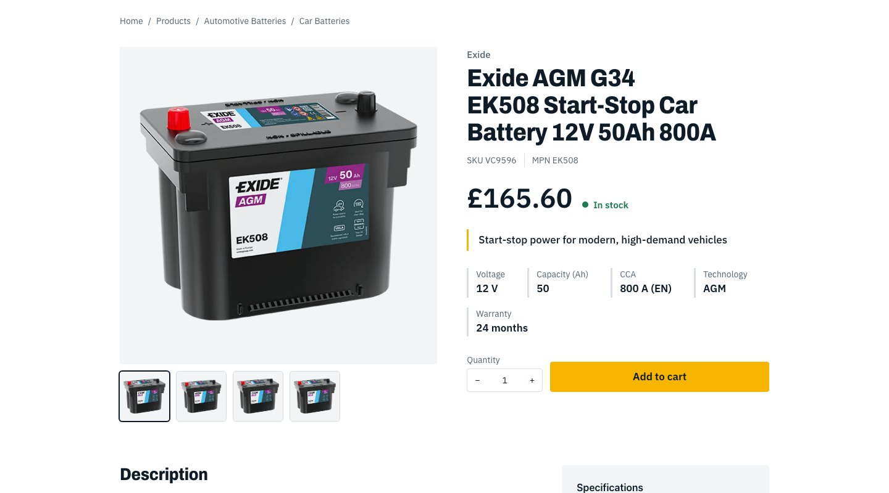

# Commerce B2B storefront

**Live:** https://storyblok-commerce-b2b.vercel.app (English) and https://storyblok-commerce-b2b.vercel.app/fr (French)

A headless B2B storefront for trade batteries. **Content** (pages, articles, guides, FAQs, navigation, banners) lives in
**Storyblok**; the **catalog, prices and cart** live in **BigCommerce**; **Next.js 16** (App Router) composes them.
The site is bilingual (English at `/`, French at `/fr`) and editors can edit it visually in Storyblok's Visual Editor.

This is the same storefront as the ContentStack, Amplience and Contentful versions (same pages, images and UI), with Storyblok as the CMS.
Pages and posts are **ordered lists of inline blocks** that editors can reorder in the Visual Editor. The UI, the content model (`core/`) and
the Storyblok provider are shared with the private switchable project `content-commerce-b2b`, reduced here to Storyblok only (no switcher,
no other CMS).


```
  Storyblok (EU)                  BigCommerce (headless channel)
  content, 2 languages            catalog, prices, cart, checkout
        │  Content Delivery API           │  Storefront GraphQL
        └──────────────┐      ┌──────────┘
                       ▼      ▼
                 Next.js 16 storefront  ──►  Visitors (EN / FR)
                       ▲
             Visual Editor (editors)
```

## What is in it

| Area | What you get |
|---|---|
| **Home** | CMS-driven page made of blocks (hero with a staggered photo pair, intro, shop-by-category mosaic, value blocks, trade favourites, guides) in the order the editor chose |
| **Catalog** | Mega menu from the live category tree; listing and category pages with search-as-you-type, sort, and brand / technology / voltage / warranty / price filters; filters apply on click and show as removable chips |
| **Product page** | Gallery, price, stock, key specs, volume pricing, description, spec table, related guides and products, structured data |
| **Cart** | Add to cart, dynamic quantity stepper with instant totals, remove, hosted checkout hand-off |
| **Content** | Blog (36 articles, 6 authors), 6 buying guides, 15 FAQs, banners, announcement bar, navigation |
| **Languages** | English and French: routes, UI text, prices, dates and all Storyblok content (field-level translation) |
| **Editing** | Storyblok Visual Editor: click a block to edit it, typing, reordering and adding blocks re-render the page while you edit, English and French |
| **Design** | "Workbench": light theme, 1100px pages, photography-led |

## Screenshots

<table>
<tr>
<td width="50%"><br><sub>Listing: search-as-you-type, removable filter chips, facets from BigCommerce</sub></td>
<td width="50%"><br><sub>Product page: gallery, price, stock, key specs, add to cart</sub></td>
</tr>
<tr>
<td><br><sub>Cart: instant quantity changes, saved to BigCommerce</sub></td>
<td><br><sub>The same page in English and French</sub></td>
</tr>
<tr>
<td><br><sub>Mega menu built from the live category tree</sub></td>
<td><br><sub>Buying guide with numbered steps and recommended products</sub></td>
</tr>
<tr>
<td><br><sub>Visual Editor: select a block on the page, edit its fields in the sidebar (screenshot of the earlier fixed-layout Home)</sub></td>
<td><br><sub>The Storyblok content model: content types and nestable blocks (before the block components were added)</sub></td>
</tr>
</table>

## Quick start

Requirements: Node 22+, Python 3.12+ with Pillow (only for the seeding scripts), a Storyblok space and a BigCommerce
store with a storefront channel.

```bash
npm install
cp .env.example .env.local      # then fill in the values (see docs/operations.md)
npm run dev                     # http://localhost:3000   (French: /fr)
```

Common commands:

```bash
npm run dev          # development server (Turbopack)
npm run dev:https    # same over HTTPS, needed to edit in the Storyblok Visual Editor
npm run lint         # ESLint
npx tsc --noEmit     # type-check
npm run build        # production build

# Model and seed the space (idempotent; needs STORYBLOK_OAUTH_TOKEN)
python3 tools/storyblok/schemas.py      # French language + components (add --prune to remove what left the model; see docs/seeding.md)
python3 tools/storyblok/seed.py         # images and stories, English + French, published; creates pages/* from blocks
python3 tools/storyblok/blocks.py       # additive upgrade of a space that still has the old model (page stories + post content blocks)
python3 tools/storyblok/backup.py       # save the whole space to .backups/ before a destructive change
python3 tools/storyblok/editor.py       # Visual Editor preview environments (production, staging, local)
```

## Project layout

```
app/
  [locale]/                  every page lives under the locale segment
    layout.tsx               html lang, edit support, announcement bar, header (mega menu), footer
    page.tsx                 home (the Page with key `home`)
    [...slug]/page.tsx       any other Page by key: faq, guides, blog, or a page an editor adds (key -> story `pages/<key>`)
    blog/[slug]  guides/[slug]   article and guide detail pages
    products/                listing, and [...slug] for categories and product pages
    cart/                    cart
  actions/cart.ts            server actions: add to cart, set quantity, remove
  globals.css                design tokens and base/component styles
proxy.ts                     locale routing (English rewritten to /en, French under /fr), translated catalog roots (x-catalog-root),
                             verified draft header (signed `_storyblok_tk`), editor slug rewrites, frame-ancestors for Storyblok
core/
  content.ts                 the content model: Block, Page, Post, Guide, Faq, Spotlight, Navigation...
  edit.ts                    edit attributes (`$`) and the `tag(entity, field)` helper
providers/cms/
  storyblok/                 client (Delivery API, live-edit story, helpers), mapper (stories to the model), index,
                             actions (`liveEditUpdate`), live-editing (the bridge), edit-support
  gates.ts  meta.ts          draft gate (signed editor URL), frame-ancestors origins
components/                  UI building blocks: page-blocks (one view per block type), page-content, hero, cards, mega menu, cart...
lib/
  content.ts                 facade the pages call (getPage, getPosts, getGuide...), reads through the Storyblok provider
  request.ts                 `isPreviewRequest()`: the proxy's verified preview header
  bigcommerce.ts             Storefront GraphQL: products, categories, search, cart
  i18n.ts                    locales, URL helpers, UI strings, label maps
tools/storyblok/             content model, seeders, backup, Visual Editor setup, French translations, photos
docs/                        documentation (start at docs/README.md)
HISTORY.md                   every request and its result
```

## Documentation

Start with **[docs/README.md](docs/README.md)**. Highlights:

- [Architecture](docs/architecture.md): how the pieces fit, routing, rendering and caching
- [Implementation details](docs/implementation.md): how each feature works
- [Storyblok](docs/storyblok.md): the space, tokens, the block content model, reading and publishing
- [Visual Editor](docs/visual-editor.md): signed preview URLs, the bridge and live edits, editor URLs, languages, troubleshooting
- [BigCommerce](docs/bigcommerce.md): channel, token, queries, listing, cart
- [Internationalization](docs/i18n.md): locales, URLs, translation workflow
- [Seeding](docs/seeding.md): sample content scripts, backup and the pending prune
- [Design system](docs/design-system.md): tokens, type, components
- [Operations](docs/operations.md): environment variables, deployment, troubleshooting
- [Decisions](docs/decisions.md): why things are the way they are

## Important notes

- **All sample content is fictional.** Author names, article text, FAQ policies, delivery claims and the
  `example.com` contact details are placeholders. Replace them before going public.
- **Product, category and custom-field text is translated by BigCommerce** (Store Translations) and read with the locale
  directive, with BigCommerce's translated catalog URLs (`/products/...`, `/fr/produits/...`) and a language switcher that finds the
  matching page. UI text, navigation and fallbacks live in `lib/i18n.ts`.
- The Storyblok space is on a **trial plan** that ends around 21 November 2026; confirm a plan for continued use.
- **The prune is pending.** The space still holds the earlier fixed-layout fields and stories next to the block model (the site no longer reads
  them). `tools/storyblok/schemas.py --prune` (after `backup.py`, and a reseed of posts and pages) is prepared and has not been run; see
  [docs/seeding.md](docs/seeding.md).
- Secrets live only in `.env.local` (gitignored). The personal access token is used by the seeding scripts, never by the
  running storefront; the live site reads published content with the Public token.
