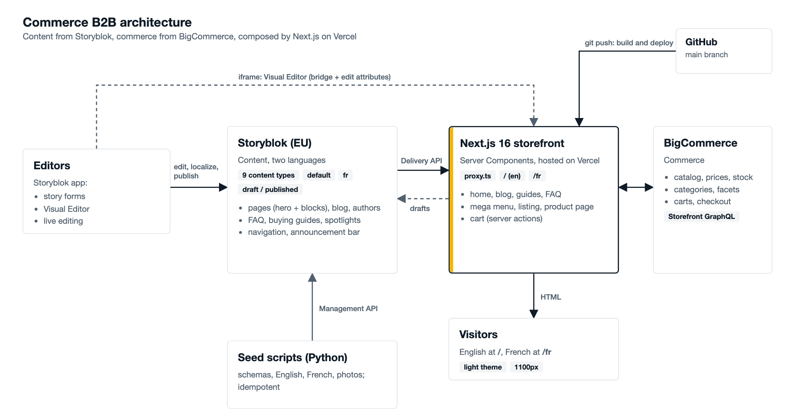

# Architecture

## Overview


*Editors work in Storyblok; the Next.js storefront on Vercel composes Storyblok content with BigCommerce commerce data. The editable source is `images/source/architecture.html`.*

<details>
<summary>Text version of the diagram</summary>

```
                          ┌────────────────────────── Editors ───────────────────────────┐
                          │ Storyblok app: story forms + Visual Editor (live editing)    │
                          └───────────────┬───────────────────────────────▲──────────────┘
                                          │ publish                       │ iframe (draft)
                                          ▼                               │
   ┌──────────────────────────┐   ┌────────────────────┐      ┌───────────┴────────────┐
   │ Storyblok (EU)           │   │ BigCommerce        │      │ Next.js 16 storefront  │
   │ • 9 content types        │   │ "commerce b2b"     │      │ proxy.ts → [locale]    │
   │ • languages default, fr  │   │ headless channel   │◄─────┤ Server Components      │
   │ • draft / published      │◄──┤ catalog, prices,   │ GQL  │ Server Actions (cart)  │
   └──────────────▲───────────┘   │ carts, checkout    │      │ small Client Components│
                  │ Delivery API  └────────────────────┘      └───────────┬────────────┘
                  └───────────────────────────────────────────────────────┘
                                                                           ▼
                                                                  Visitors (EN at /, FR at /fr)
```

</details>

Two systems of record, one composition layer:

| Concern | Lives in | Why |
|---|---|---|
| Pages, articles, guides, FAQs, banners, navigation, announcements, product *storytelling* | Storyblok | Editors own wording, imagery, structure and translations |
| Catalog, categories, brands, prices, stock, carts, checkout | BigCommerce | Commerce data must stay authoritative and live |
| Product spotlight ↔ product link | `product_spotlight.bc_product_id` | Editorial content is *keyed* to a product ID; price and stock are never copied into the CMS |

## Technology

| Layer | Choice |
|---|---|
| Framework | Next.js 16.3 (App Router, Turbopack), React 19.2, TypeScript |
| Styling | Tailwind CSS v4 + CSS custom properties (see [design-system.md](design-system.md)) |
| Content | Storyblok Content Delivery API through `storyblok-js-client`, rich text through `@storyblok/richtext` |
| Editing | `@storyblok/react` (`StoryblokLiveEditing`, the Storyblok bridge) |
| Commerce | BigCommerce Storefront GraphQL API (plain `fetch`) |
| Fonts | Archivo (display, variable width) and IBM Plex Sans via `next/font/google` |
| Tooling | Python 3 + Pillow for the seeding scripts |

> The project's `AGENTS.md` warns that this Next.js version has breaking changes. The docs in
> `node_modules/next/dist/docs/` are the reference (e.g. `params` and `searchParams` are Promises, the middleware file is
> now `proxy.ts`).

## Request lifecycle

1. **`proxy.ts`** runs first. `/fr/...` passes through. `/en/...` redirects (308) to the clean URL. `/home` and `/fr/home` (the URLs
   the Visual Editor opens for the Home story) are rewritten to the home pages. Every other path is *rewritten* internally to
   `/en/...`, so English keeps clean URLs while still matching `app/[locale]`.
2. **`app/[locale]/layout.tsx`** validates the locale, sets `<html lang>`, and renders the announcement bar, header
   (with the mega menu) and footer. These fetch their own data in parallel with the page.
3. **The page** (a Server Component) reads `params`/`searchParams`, decides whether it is a Visual Editor request, fetches content from
   Storyblok and commerce data from BigCommerce in parallel (`Promise.all`), and renders HTML.
4. **Client Components** hydrate only where interaction is needed (listed below).
5. **Server Actions** handle cart mutations; they set the cart cookie and revalidate the layout so the header badge updates.

```
Browser ──► proxy.ts ──► app/[locale]/…page.tsx ──┬─► lib/site.ts, lib/blog.ts ──► lib/storyblok.ts ──► Storyblok CDN
                                                  └─► lib/bigcommerce.ts       ──► BigCommerce GraphQL
```

## Rendering and caching

- Every page is **dynamically rendered**: it reads `searchParams` (editor requests, filters) and/or cookies (cart).
- **BigCommerce** reads use `fetch` with `next: { revalidate: 300 }` (5 minutes), except carts (`no-store`).
- **Storyblok** published reads use `next: { revalidate: 60 }`; draft reads (Visual Editor) are `no-store`. Within one request, React
  `cache()` shares a story between `generateMetadata`, the page and the layout.
- Authors are fetched once per request and joined by uuid, instead of resolving `author` on every post.

## Client Components (the only JavaScript that ships for interaction)

| Component | Purpose |
|---|---|
| `StoryblokLiveEditing` (via `EditSupport`) | loads the Storyblok bridge, only inside the Visual Editor |
| `LocaleSwitcher` | links to the same page in the other language |
| `MegaMenu` | hover/click product menu |
| `PlpForm`, `SearchBox`, `PriceRange`, `SortSelect` | auto-applying filters and search-as-you-type |
| `ProductGallery`, `AddToCart` | product page interaction |
| `CartView`, `QtyStepper` | optimistic cart editing |

Everything else is server-rendered HTML.

## Data model at a glance

```
page ──hero──► hero_banner (block)               blog_listing_page ──hero──► hero_banner (block)
page ──blocks──► feature_block (blocks)          blog_listing_page ──featured_posts / related_posts──► blog_post
blog_post ──author──► author                     buying_guide ──author──► author
blog_post ──related_post──► blog_post            buying_guide ──related_faqs──► faq
product_spotlight ··bc_product_id·· BigCommerce product     buying_guide ··recommended_bc_products·· BigCommerce products
announcement_bar    site_navigation (one story in settings/)
```

References (`──►`) are Storyblok story references (stored as uuids); `(block)` items live inside the story. Dotted links (`··`) are
plain IDs resolved at request time against BigCommerce, so a deleted or renamed product never breaks a content story.

## Security model

- Tokens are server-side only (no `NEXT_PUBLIC_` variables). The storefront needs the **Public** token (published content), the
  **Preview** token (drafts for the Visual Editor) and a **scoped** BigCommerce Storefront token.
- Drafts are served only for requests carrying a valid signed Visual Editor URL ([visual-editor.md](visual-editor.md#how-draft-mode-is-switched-on)).
- The BigCommerce Storefront token is created per **origin** and per **channel**. It expires (90 days by default).
- The **personal access token** exists only for the seeding scripts.
- `Content-Security-Policy: frame-ancestors` allows only Storyblok's editor to embed the site.
- Edit attributes and the bridge appear only for editor requests, so published HTML carries no editing markup.
- Rich text from Storyblok and BigCommerce is rendered with `dangerouslySetInnerHTML`. Both are trusted,
  editor-controlled sources; do not render visitor-supplied HTML this way.
