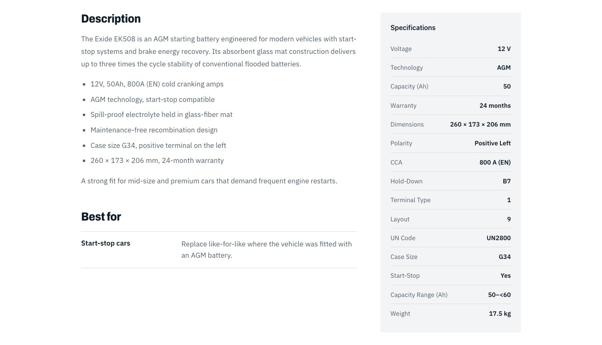

# BigCommerce

The storefront reads the catalog and runs the cart through BigCommerce's **Storefront GraphQL API**. Nothing from the
catalog is copied into Storyblok except product IDs and SKUs used as keys.

## Store and channel

| Item | Value |
|---|---|
| Store | your BigCommerce store (hash in `BIGCOMMERCE_STORE_HASH`) |
| Channel | a headless / Catalyst storefront channel (`BIGCOMMERCE_CHANNEL_ID`) |
| Catalog | 150 products in 5 top-level categories (below) |
| Currency | GBP (prices are formatted in the visitor's locale) |
| Guest pricing | Prices are visible to guests (a store setting) |

Top-level categories and subcategories (counts are products):

| Category | Subcategories |
|---|---|
| Automotive Batteries (38) | Car Batteries 14, Motorcycle & Powersports 12, Truck & Agricultural 12 |
| Leisure & Deep-Cycle (34) | Deep-Cycle & Mobility 12, Lithium & LiFePO4 10, Marine & RV 12 |
| Industrial & Standby (24) | Power Tool 12, Standby & Alarm 12 |
| Consumer Batteries (34) | Button & Coin Cells 12, Household 12, Rechargeable 10 |
| Chargers & Accessories (20) | Battery Chargers 12, Jump Starters & Boosters 8 |


*The category tree above, as the storefront mega menu.*

## Authentication: the channel-scoped token

A **Storefront API token** is created for one channel and one allowed origin:

```
POST /stores/<hash>/v3/storefront/api-token
{ "channel_id": <channel-id>, "expires_at": <unix>, "allowed_cors_origins": ["http://localhost:3000"] }
```

Two rules matter:

1. A channel token must call the **channel-specific host**: `https://store-<hash>-<channel>.mybigcommerce.com/graphql`.
   The default store host answers *"JWT channel id doesn't match channel id of the URL"*.
2. A token is created for **one allowed origin**, which governs *browser* (CORS) requests. This storefront calls BigCommerce
   only from the server (no `Origin` header), and the token created for `http://localhost:3000` was verified to work from
   Vercel. A token per environment is still the tidier practice. Tokens expire (this one in January 2027): rotate before
   then and redeploy.

The token is stored as `BIGCOMMERCE_STOREFRONT_TOKEN` and used only on the server (`lib/bigcommerce.ts`).

## Client: `lib/bigcommerce.ts`

`gql(query, variables, { locale, revalidate })` posts to the channel host. For a non-default locale it adds the `@shopperPreferences` locale directive (see below) and
caches reads for 300 s (`revalidate: false` = `no-store`, used for carts). Query fragments:

- **`CARD_FIELDS`**: id, name, SKU, path, brand, default image (640 px), price / sale price / retail price, in-stock flag.
- Functions never throw for reads: errors are logged and an empty result is returned so a BigCommerce hiccup degrades one
  section instead of crashing the page.

### Functions

| Function | Purpose |
|---|---|
| `getBcProducts(ids, locale)` | live cards for a list of product IDs (spotlights, guides) |
| `searchCatalog(locale, query)` | **faceted listing**: category, text, brands, attribute facets, price, sort, cursor |
| `getCategoryByPath(path, locale)` | category info (entity ID, name, description, breadcrumbs) |
| `getCategoryTree(locale)` | the category tree (mega menu, subcategory chips) |
| `getProductByPath(path, locale)` | product detail (images, description, custom fields, bulk pricing, related products, breadcrumbs) |
| `addProductToCart`, `setCartLineQuantity`, `removeCartLine` | cart mutations |
| `getCart`, `getCartCount` | cart reads (with checkout URL) |
| `parseCatalogParams(searchParams)` | URL parameters → query |
| `formatPrice` | = `formatMoney` from `lib/i18n.ts` (client-safe) |

### Faceted search

```graphql
query($filters: SearchProductsFiltersInput!, $sort: SearchProductsSortInput, $cursor: String) {
  site { search { searchProducts(filters: $filters, sort: $sort) {
    products(first: 24, after: $cursor) { edges { node { …card } } pageInfo { … } collectionInfo { totalItems } }
    filters { edges { node { __typename name
      ... on BrandSearchFilter { brands { edges { node { entityId name productCount isSelected } } } }
      ... on ProductAttributeSearchFilter { attributes { edges { node { value productCount isSelected } } } }
    } } }
  } } }
}
```

Filter input fields used: `categoryEntityId`, `searchTerm`, `brandEntityIds`, `price { minPrice maxPrice }`,
`productAttributes [{ attribute, values }]`. Sort values: `FEATURED`, `NEWEST`, `BEST_SELLING`, `LOWEST_PRICE`,
`HIGHEST_PRICE`, `A_TO_Z`.

Behaviours to know:

- **At least one filter is required.** For "all products" the query uses the **root category** (looked up once and memoised).
- **A category includes its descendants' products**, unlike `category.products`, which lists only directly assigned ones.
- **Cursors are tied to the filters and sort** that produced them; changing either resets paging (the UI does this).
- Last-page `before`/`after` use `first/last` accordingly.

### Which facets are shown and why

Attribute facets come from product custom fields. Coverage across the 150 products:

| Facet | Products with a value | Values | Shown? |
|---|---|---|---|
| Technology | 139 (93%) | 25 | **yes** |
| Voltage | 133 (89%) | 18 | **yes** |
| Warranty | 99 (66%) | 5 | **yes** |
| Capacity range (Ah) | 81 (54%) | 19 | no (too sparse) |
| Format | 39 (26%) | 23 | no (mostly batteries other than car/truck) |

Plus **Brand** and **Price**. Each facet shows at most 8 values (`MAX_FACET_VALUES`). To change the set edit `FACET_NAMES`
and add French names/values to `lib/i18n.ts` (`SPEC_NAMES_FR`, `translateSpec`).


*The facets the table describes, as shown on a category page.*

### Product detail query

`getProductByPath` uses `site.route(path)` and reads: description (HTML), plain-text description, MPN, GTIN, weight, min/max
purchase quantity, availability, all images (1200 px), custom fields (the spec table), bulk pricing (fixed price or percent
off), the first category's breadcrumbs, and four related products. A route that is not a `Product` returns `null`
(→ the catalog route then tries a category).


*Product detail data from BigCommerce: description (HTML), custom fields as the specification table.*

### Cart

| Step | Mutation |
|---|---|
| Create | `cart.createCart(input: { lineItems: [{ productEntityId, quantity }] })` |
| Add | `cart.addCartLineItems(input: { cartEntityId, data: { lineItems } })`; if the cart expired, a new one is created |
| Quantity | `cart.updateCartLineItem(input: { cartEntityId, lineItemEntityId, data: { lineItem: { productEntityId, quantity } } })` |
| Remove | `cart.deleteCartLineItem(input: { cartEntityId, lineItemEntityId })` |
| Checkout | `cart.createCartRedirectUrls(input: { cartEntityId })` → `redirectedCheckoutUrl` (hosted checkout) |
| Read | `site.cart(entityId)` with `lineItems { totalQuantity physicalItems { … } }` and `amount` |

The cart ID is kept in the `bc_cart_id` cookie (httpOnly, `SameSite=Lax`, 30 days). Removing the last line may delete the
cart on BigCommerce's side; reads of a missing cart return `null` and the UI shows the empty state.

Test carts created during development are anonymous and expire on their own.

## Localization of commerce data

- UI labels, category and subcategory names (curated map), spec names and common spec values are translated in
  `lib/i18n.ts`.
- **Translated catalog content.** The store has French (and other) translations for products, categories and custom fields
  (BigCommerce *Store Translations*). The Storefront API **ignores `Accept-Language`**: a locale is selected with an
  `@shopperPreferences(locale: "fr")` directive on the operation, which `gql()` inserts for every non-default locale
  (short code `fr`; `fr-FR` is not accepted). Names, descriptions, custom-field names and values, category names and facet
  *values* then come back translated, while facet filter *names* stay English.
- **URLs stay shared.** BigCommerce also translates URL paths (`/produits/...`), but the storefront keeps one URL scheme with the
  English slugs ([decisions.md](decisions.md), D9). So in a translated language: product and category `path`s are restored from the
  default-locale catalog by entity id (`restoreProductPaths`, `defaultCategoryPaths`); a product page resolves the English path
  first and then reads the translated content **by id** (a product path only resolves in its own language); related products,
  breadcrumbs and cart links use the restored paths; and spec labels keep their English name as `key`, which the key-spec
  highlights match on.
- UI labels, spec names and common spec values in `lib/i18n.ts` and the curated category map remain as fallbacks for anything
  BigCommerce has not translated.
- Prices are formatted per locale (`165,60 £GB` in French) but are always in the store's currency (GBP). Multi-currency
  would need BigCommerce currency settings and a currency choice in the UI.

## B2B Edition note

The store has B2B Edition, but this storefront does **not** yet integrate company accounts, price lists per buyer,
quotes or sign-in. "Your negotiated prices" is marketing copy until buyer login is built (Customer Access Token + B2B APIs).
See [decisions.md](decisions.md).
