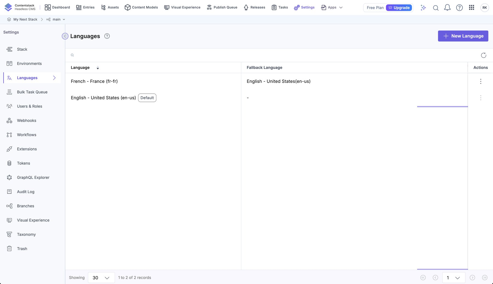
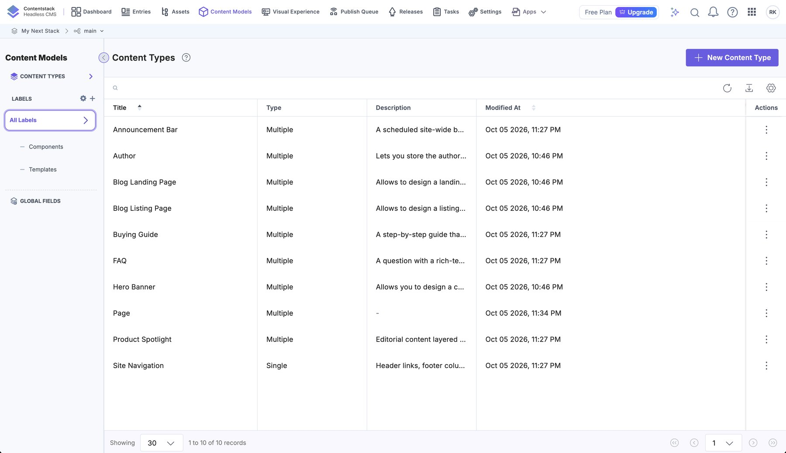
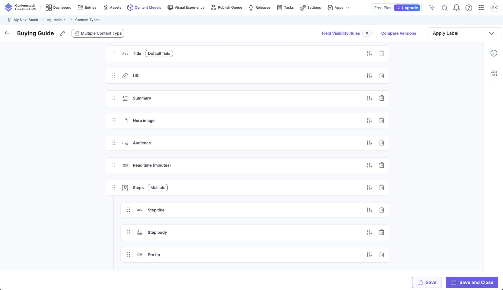
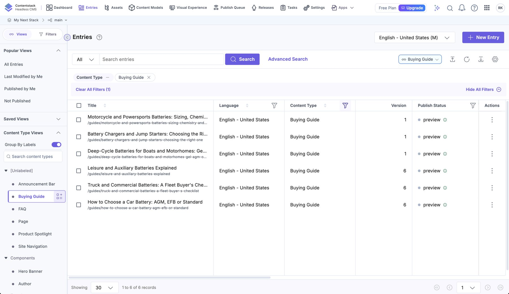
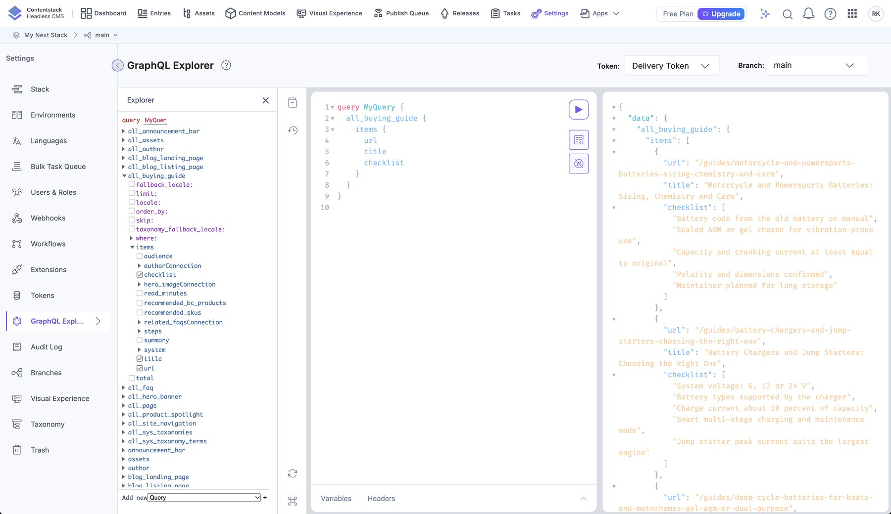
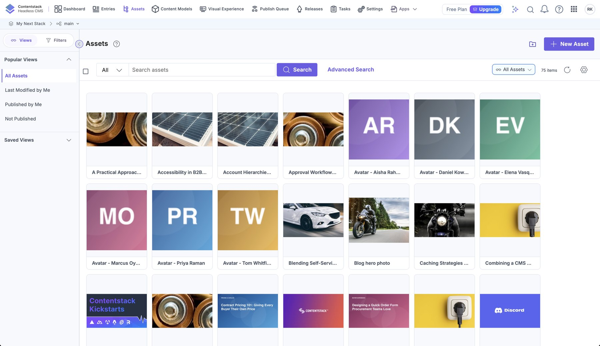

# Contentstack

## The stack

| Setting | Value |
|---|---|
| Stack name | "My Next Stack" (branch `main`) |
| Region | **EU** → API `eu-api.contentstack.com`, CDN `eu-cdn.contentstack.com`, app `eu-app.contentstack.com`, preview `eu-rest-preview.contentstack.com` |
| Environments | **`production`**: the live site. **`preview`**: the staging site (Vercel branch `staging`). **`local`**: localhost (nothing published). Publishing to `production` needs the entry to be **Approved** ([workflow.md](workflow.md)). See *Environments and tokens* below |
| Locales | `en-us` (master) and `fr-fr` (fallback → `en-us`) |
| Plan | Free: **10 content types maximum** (all used) |

Host names are derived from `CONTENTSTACK_REGION` in `lib/contentstack.ts` (`us` has no prefix; others are `<region>-…`).
Using the wrong region's host returns *"api_key is not valid"*.


*Settings → Environments: `production` (the live site), `preview` (the staging site) and `local` (localhost), each with its own Live Preview base URL per locale.*


*Settings → Languages: English (the default and master) and French, which falls back to English.*

### Environments and tokens

Three environments. Content is published to `preview` first, then (once approved) to `production`; nothing is published to `local`:

| Environment | Read by | Token scope |
|---|---|---|
| `production` | the live site on Vercel (Production scope) | a delivery token **and** a preview token bound to `production` |
| `preview` | the staging site and Vercel Preview deployments, and local development (`.env.local`) | a delivery token and a preview token bound to `preview` |
| `local` | nothing reads it; a base URL so Visual Editor can open `localhost` | none |

A delivery token only sees its own environment: asking the Delivery API for `production` with the `preview` token returns
*"Environment was not found"*. Each deployment reports its environment in the **`X-Content-Environment`** response header
(`curl -sI https://contentstack-commerce-b2b.vercel.app | grep -i x-content`).

**Going live is gated.** Publish to `preview` and check the staging site, set the entry's workflow stage to **Approved**,
then publish to `production`; Contentstack refuses the production publish for any entry that is not Approved. The full
routine, the publishing rule and its limits are in [workflow.md](workflow.md). To publish everything at once:
`python3 scripts/seed/publish_environment.py production --approve` (idempotent; `--approve` first moves entries to Approved).

**Creating tokens.** Delivery and preview tokens can only be created in the Contentstack app (Settings → Tokens →
Delivery Tokens, with *Create Preview Token* on). A **management token cannot** create them (the API answers *"insufficient
permissions"*). Put the values straight into Vercel (dashboard, or `vercel env add … production --sensitive`); never paste
them into chats or commit them.

To move another environment over, repeat what was done for `production`: publish the content, create its two tokens, set
`CONTENTSTACK_ENVIRONMENT`, `CONTENTSTACK_DELIVERY_TOKEN` and `CONTENTSTACK_PREVIEW_TOKEN` for that deployment scope in
Vercel, and redeploy.

## Credentials

| Credential | Used by | Notes |
|---|---|---|
| API key | storefront, scripts | identifies the stack (not secret, but kept server-side) |
| Delivery token | storefront | read-only, bound to an environment |
| Preview token | storefront (preview only) | read draft/unsaved content via the preview host |
| Management token | seeding scripts only | write access; needs publish rights; never in the browser |

## Content types

Ten types, all in `scripts/seed/schemas.py` (the last five) or created by the starter kit (the first five).


*Content Models → Content Types: the ten types (nine multiple, plus the single `Site Navigation`). The free plan allows no more.*

### Starter types

| UID | Purpose | Key fields |
|---|---|---|
| `page` | URL-addressed pages: home (`/`), FAQ (`/faq`), buying guides (`/guides`) | `title` (unique), `url`, `description`, `image`, `rich_text` (HTML RTE), `blocks` (modular, uses the `block` global field: title, copy, image, layout), **`hero`** (reference → `hero_banner`, added by us) |
| `hero_banner` | Reusable page hero | `title`, `banner_image`, `banner_description`, `call_to_action` (link), `is_banner_image_full_width_`, alignment fields |
| `author` | Article / guide author | `title` (name, unique), `picture` (required), `bio` |
| `blog_landing_page` | An article (URL prefix `/blog/`) | `title`, `url`, `author` (ref), `date`, `featured_image` (required), `body` (JSON RTE), `related_post` (ref), `is_archived`, `seo` (global field: meta title/description, keywords, indexing) |
| `blog_listing_page` | The blog index (`/blog`) | `title`, `url`, `search` (group), `page_components` (modular: `hero_banner`, `from_blog`, `widget`), `seo` |

### Types added for this storefront

| UID | Purpose | Key fields |
|---|---|---|
| `faq` | A question and rich-text answer | `title` (the question), `answer` (JSON RTE), `topic` (select), `sort_order`, `is_featured` |
| `buying_guide` | Step-by-step guide (prefix `/guides/`) | `title`, `url`, `summary`, `hero_image`, `audience` (select), `read_minutes`, `steps` (group, repeatable: `step_title`, `step_body`, `pro_tip`), `checklist` (text, repeatable), `recommended_bc_products` (numbers), `recommended_skus`, `related_faqs` (refs → `faq`), `author` (ref) |
| `product_spotlight` | Editorial layer over a BigCommerce product | `title`, **`bc_product_id`** (required), `bc_sku`, `tagline`, `editorial_summary` (JSON RTE), `key_features`, `use_cases` (group), `pairs_well_with_skus`, `badge` (select), `editorial_image`, `is_featured` |
| `announcement_bar` | Scheduled site-wide banner | `title` (internal), `message`, `cta` (link), `style` (`info` / `promo` / `warning`), `audience` (`everyone` / `logged_in` / `guests`), `starts_at`, `ends_at`, `is_active` |
| `site_navigation` | Header, footer and contact (singleton) | `header_links` (group: label, href, highlight), `footer_columns` (group → links group), `contact` (sales email, phone, hours), `legal_text` |

Select (enum) fields store **fixed English values**; the storefront maps them to French labels for display
(`topicLabel`, `audienceLabel`, `badgeLabel` in `lib/i18n.ts`). Add a new choice in both places.


*The Buying Guide type in the content type builder: URL, summary, hero image, audience, read time and the repeatable **Steps** group (step title, step body, pro tip).*

### Rules that bit us (and are enforced by the API)

- `title` is **unique** per content type (and per locale). French titles that equal the English one are fine.
- UIDs ending in `_ids` such as `recommended_product_ids` are **reserved**; use a different name.
- A JSON-RTE `body` is stored as a document tree; `scripts/seed/seed.py → rte()` builds one from paragraphs, headings and lists.
- `file` fields (`picture`, `featured_image`, `hero_image`, `banner_image`) hold an **asset UID** when writing.
- A `widget.type` value must match the enum (`Blog Archive`, `Related Posts`).
- A modular block is addressed by its key: `{"from_blog": {…}}`.

## Entries (current sample content)

| Type | English | French |
|---|---|---|
| author | 6 | 6 |
| blog_landing_page | 36 | 36 |
| blog_listing_page | 1 | 1 |
| hero_banner | 4 (home, FAQ, guides, blog) | 4 |
| page | 3 (`/`, `/faq`, `/guides`) | 3 |
| faq | 15 | 15 |
| buying_guide | 6 | 6 |
| product_spotlight | 6 | 6 |
| announcement_bar | 2 | 2 |
| site_navigation | 1 | 1 |

All content is fictional sample text. Replace it in Contentstack, or edit the seed data and re-run the scripts
([seeding.md](seeding.md)).


*Entries filtered to Buying Guide: the six guides, their URLs and where they are published. (This capture was taken before the production environment was filled, so it shows only `preview`.)*

## Publishing

Entries and assets must be **published to `preview`** to be visible through the delivery token. For a localized entry the
publish request must include the entry's locale at the top level:

```json
POST /v3/content_types/<uid>/entries/<entry>/publish
{ "entry": { "environments": ["preview"], "locales": ["fr-fr"] }, "locale": "fr-fr" }
```

Referenced entries and assets should be published before the entries that use them (the seeders publish in dependency order).

## Localization behaviour

A localized (`fr-fr`) entry is a full copy of the master with translated fields. Because it is a **copy**, changing a
non-translatable field (an image) on the English entry does **not** update the French entry. Either edit both, or
re-run `seed_fr.py`. Untranslated entries fall back to English at read time (`includeFallback`). See [i18n.md](i18n.md).

## Inspecting content with the GraphQL Explorer

Contentstack also exposes a GraphQL API. The storefront uses the Delivery SDK, but the **GraphQL Explorer** (Settings → GraphQL
Explorer, with a delivery token and a branch) is the quickest way to see exactly what a published entry looks like:


*Querying `all_buying_guide { items { url title checklist } }` with the delivery token: the published guides and their checklists.*

## Assets

Images are generated or cropped by the seeders and uploaded to the root of the asset library. They are served from
`eu-images.contentstack.com` (allowed in `next.config.ts`); the Image Delivery API supports URL parameters for resizing
if you want Contentstack to do the transformations instead of `next/image`.


*The asset library: author avatars, post and guide photos, hero images. (Contentstack's own starter assets, such as the Kickstarts and Discord tiles, are from the starter kit.)*
