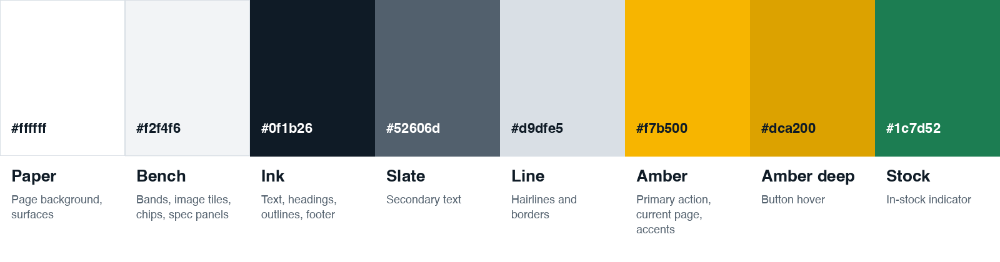
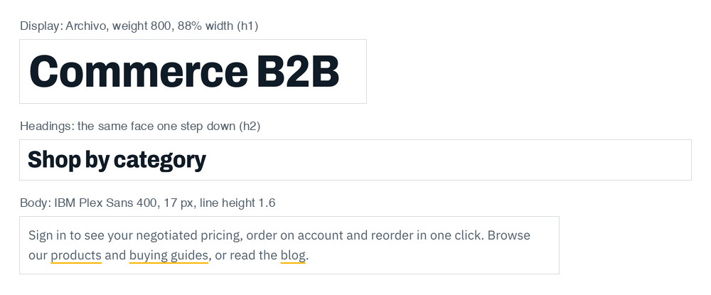
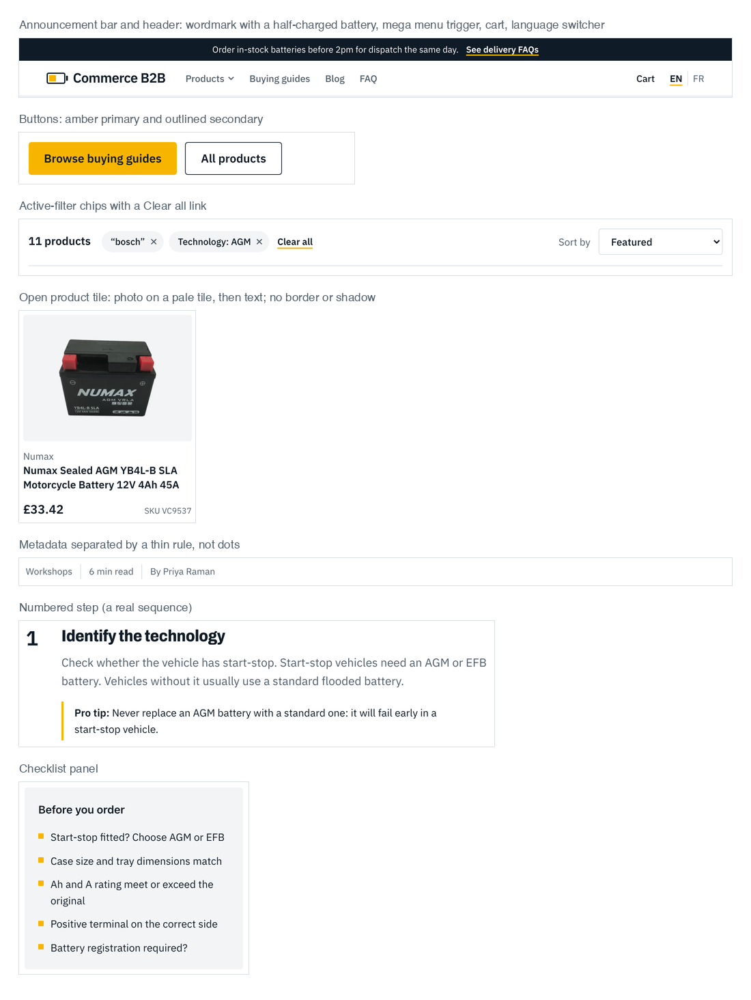

# Design system: "Workbench"

A light, practical look for a trade supplier: cool steel surfaces, blue-black ink, and one accent borrowed from a battery
terminal. Photography carries the personality; the interface stays quiet.

## Principles

1. **Photography does the talking.** Real photos of cars, tools, chargers and cells lead the home page, categories and guides.
2. **One accent, used rarely.** Amber is for the primary action and the current state only.
3. **Open layouts over boxed cards.** Product tiles are a photo on a pale tile with text beneath; lists use hairlines; no
   drop shadows; one small radius (4 px).
4. **One page width.** Everything sits in a 1100 px column (`.page`).
5. **Text-free imagery.** Titles are real text on the page, never baked into a picture.
6. **Structure encodes information.** Numbers only where there is a sequence (guide steps); rules separate list items; no
   decorative eyebrows.

What this deliberately avoids: cream-and-terracotta palettes, dark mode with a neon accent, newspaper-column layouts,
identical rounded cards with soft shadows, all-caps tracked labels above headings, `A · B · C` metadata strings, and
arrows appended to link text.

## Tokens (`app/globals.css`)

*The eight colour tokens.*

| Token | Value | Use |
|---|---|---|
| `--paper` | `#ffffff` | page background, surfaces |
| `--bench` | `#f2f4f6` | pale steel: bands, image tiles, filter chips, spec panels |
| `--ink` | `#0f1b26` | text, headings, outlines, footer |
| `--slate` | `#52606d` | secondary text |
| `--line` | `#d9dfe5` | hairlines and borders |
| `--amber` | `#f7b500` | primary button, current-page underline, accents |
| `--amber-deep` | `#dca200` | button hover |
| `--stock` | `#1c7d52` | in-stock indicator |
| `--page-width` | `1100px` | the page column |

Tailwind exposes them as `bg-bench`, `text-slate`, `border-line`, `bg-amber`, `text-ink`, etc. (via `@theme inline`), and
legacy `foreground` / `background` map to ink / paper, so `text-foreground/70` still works.

Measured contrast (WCAG): ink on paper 17.4:1, slate on paper 6.5:1, slate on bench 5.9:1, ink on amber 9.6:1, ink on
amber-deep 7.6:1, in-stock green on paper 5.1:1, white on ink 17.4:1. **Amber is never used as text colour on white**
(amber-deep on white is only 2.3:1); it appears as fills, underlines and rules.

## Typography

*Display and body type as rendered on the live site.*

| Role | Font | Settings |
|---|---|---|
| Display (h1, h2, price, wordmark) | **Archivo** (variable width) | weight 800, `font-stretch: 88%`, tracking −0.012em, line height 1.02–1.06 |
| Body, UI | **IBM Plex Sans** 400 / 500 / 600 | 17 px base, line height 1.6, tabular numerals |

| Style | Size |
|---|---|
| h1 | `clamp(2.5rem, 5.2vw, 4rem)` |
| h2 | `clamp(1.75rem, 3vw, 2.375rem)` |
| h3 (card titles) | 1.0625–1.125 rem, weight 600 |
| Body | 1.0625 rem; rich text capped at 68 ch |
| Meta / captions | 0.875 rem |

Fonts load through `next/font/google` as CSS variables `--font-display` and `--font-body`. The Latin subset covers all
French characters used.

## Layout

- `.page`: `max-width: 1100px`, side padding 1.25 rem (1.5 rem from 640 px).
- `.section`: vertical rhythm (3.5 rem, 5 rem from 768 px). `.band`: full-bleed `--bench` background that alternates with
  white sections on the home page.
- Grids: product lists 4 / 3 / 2 columns; articles and guides 3 columns; detail pages use a main column plus a sticky
  sidebar (`1fr` + 17–22 rem) that stacks below `lg`.
- Header: white, hairline border, wordmark with a half-charged battery mark, mega menu, cart, language switcher.
  Footer: ink background.

## Components and utility classes

*Crops of the live site: header, buttons, filter chips, product tile, metadata, numbered step and checklist.*

| Class / component | Purpose |
|---|---|
| `.btn`, `.btn-primary` (amber), `.btn-outline` | buttons (4 px radius, 600 weight) |
| `.field` | inputs: 1.5 px line border, ink on focus |
| `.meta` | inline metadata separated by a thin rule (replaces dot-separated strings) |
| `.rte` | rendered rich text: spacing, lists, amber-underlined links |
| `Hero` | `page` variant (copy + 4:3 photo on a bench band) and `home` variant (copy + staggered photo pair) |
| `PostCard`, `GuideCard`, `ProductCard`, `SpotlightCard` | open cards: photo tile, title that underlines in amber on hover |
| `CategoryTiles` | one tall lead tile + four squares with a gradient label |
| `MegaMenu` | five-column category panel with photos and counts |
| `Plp` | search, chips, sort, facets, grid, pager |
| `CartView`, `QtyStepper` | cart lines and the quantity chooser |

Product photos use `mix-blend-multiply` on the bench tile so white photo backgrounds melt into the tile.

## Motion

Deliberately minimal, always in response to a user action: image zoom on card hover (≈300 ms), amber underline reveal,
accordion plus sign rotation, mega menu chevron, filter results dimming while loading. No entrance animations.
`prefers-reduced-motion` shortens all transitions.

## Accessibility

- Visible keyboard focus (2 px ink outline, offset 3 px); selection colour is amber.
- Semantic landmarks, one `h1` per page, labelled navs, `aria-expanded` / `aria-controls` on the mega menu,
  `aria-live` regions for the search hint and cart status, accessible names on steppers and thumbnails.
- All interactive filters work as a plain GET form without JavaScript.
- Images that are decorative have empty `alt`; product images use BigCommerce alt text.

## Imagery

- Source: pilesbatteries.com, text-free images only (nine photos in `scripts/seed/photos/`, five category crops in
  `public/images/categories/`). Banners with baked-in text are excluded.
- Crops are generated by `scripts/seed/photos.py` and uploaded to Contentstack; replace any image in Contentstack and it
  updates everywhere it is referenced (for French, also update the French entry).
- Product images come from BigCommerce at runtime.

## Extending

Add a colour in `:root` and `@theme inline`; prefer reusing `bench` / `line` / `slate`. Keep amber for actions. New
components should use `.page` for width, 4 px radius, hairlines instead of shadows, and sentence-case labels.
