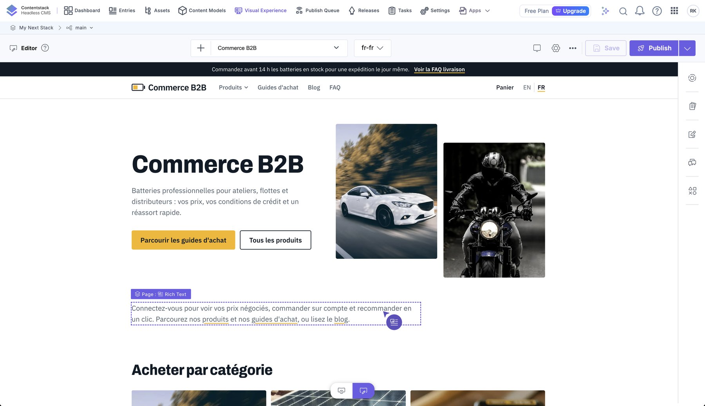

# Internationalization

Languages: **English** (default) and **French**. The architecture supports more.

*The same product page in English (`/products/…`) and French (`/fr/products/…`): UI text, prices (`165,60 £GB`) and spec labels follow the language.*

## URL strategy

| URL | Locale | Notes |
|---|---|---|
| `/blog`, `/products/…` | English | clean URLs, no prefix |
| `/fr/blog`, `/fr/products/…` | French | prefix `/fr` |
| `/en/blog` | → 308 redirect to `/blog` | each page has one canonical address |

`proxy.ts` implements this: `/fr/…` passes through; `/en/…` redirects; everything else is **rewritten** to `/en/…`
internally. All routes live under `app/[locale]/`.

Locale codes:

| URL segment | Contentstack locale | Formatting (Intl) | `lang` |
|---|---|---|---|
| `en` | `en-us` (master) | `en-GB` | `en` |
| `fr` | `fr-fr` (fallback `en-us`) | `fr-FR` | `fr` |

Defined in `lib/i18n.ts` (`LOCALES`, `CS_LOCALE`, `INTL_LOCALE`). Helpers: `localePath(locale, "/blog")`,
`stripLocale(pathname)`, `isLocale(value)`. **Always build links with `localePath`**, including links stored in
Contentstack (`/faq`, `/blog`), which are stored *without* a prefix.

## What is translated and where

| Content | Where | Mechanism |
|---|---|---|
| Articles, guides, FAQs, banners, pages, navigation, announcements, spotlights, authors | Contentstack | a localized `fr-fr` version of each entry |
| Buttons, labels, messages, filter and cart text | `lib/i18n.ts` (`en` / `fr` dictionaries) | `getMessages(locale)`; the `Messages` type forces both languages to define every key |
| Select-field values (FAQ topic, guide audience, spotlight badge) | `TOPIC_FR`, `AUDIENCE_FR`, `BADGE_FR` | `topicLabel` / `audienceLabel` / `badgeLabel` |
| Category labels | `CATEGORY_FR` | `categoryLabel` |
| Product specs (names, common values) | `SPEC_NAMES_FR` + rules | `translateSpec` |
| Dates and prices | `Intl` | `formatDate`, `formatMoney` |
| Product names and brands | BigCommerce | **not translated** (see [bigcommerce.md](bigcommerce.md)) |

## Content fallback

Every read asks for the locale **and** `includeFallback()`. A French request for an entry that has no French version
returns the English one, so the site never shows a hole. The reverse is not true: English never falls back to French.

## Slugs are shared

URLs use the same slug in both languages (`/fr/blog/contract-pricing-101-giving-every-buyer-their-own-price`). This keeps
the language switcher exact (swap the prefix), keeps `url` consistent across the two entries, and avoids a slug lookup
table. The trade-off is less SEO value than localized slugs; see [decisions.md](decisions.md).

## SEO

Pages that matter export `generateMetadata` with `alternates: alternatesFor(locale, path)`, which emits `canonical` and
`hreflang` links (`en`, `fr`, `x-default`). `<html lang>` follows the locale.

## Language switcher

*The French home page: header with the language switcher (EN / FR), translated hero, navigation and announcement bar.*

`components/locale-switcher.tsx` (client) reads the current path, strips any prefix and links to the same path in every
locale, preserving the query string (filters survive a language change).

## Translating content in Contentstack

*Settings → Languages: `fr-fr` falls back to `en-us`, the default language.*

**Via the app:** open an entry, switch locale to French → "Localize" → translate fields → publish for `fr-fr`.

**Via the scripts** ([seeding.md](seeding.md)): translations live in Python files (`content_fr.py`, `content_fr_posts.py`);
`seed_fr.py` fetches each English entry, overrides the translated fields and saves it as `fr-fr`, then publishes.

Checklist for a fully translated page:

1. Entry has a `fr-fr` version, published to `preview`.
2. Its referenced entries (authors, hero banners, FAQs) also have French versions.
3. Select-field values still match the allowed English values.
4. Links stored in the entry are **unprefixed** (the app adds `/fr`), except inside rich-text HTML, where they must be
   written with the prefix (`/fr/products`) because HTML is rendered as-is.

*Editing the French locale visually: the same page, `/fr`, with its own entry and form.*

## Adding another language (for example German)

1. **Contentstack**: add the locale (for example `de-de`) with fallback `en-us`; set its Live Preview base URL.
2. **`lib/i18n.ts`**: add `"de"` to `LOCALES`; add entries to `CS_LOCALE` (`de-de`), `INTL_LOCALE` (`de-DE`),
   `LANGUAGE_NAME`; add a `de` messages object (the type checker lists every missing key); extend the label maps
   (`TOPIC_`, `AUDIENCE_`, `BADGE_`, `CATEGORY_`, `SPEC_NAMES_`).
3. **`proxy.ts`**: allow the new prefix (`first === "fr"` → a list of non-default locales); update the `stripLocale` regex in `lib/i18n.ts`.
4. **Content**: translate entries (app or a `content_de.py` + seeder modelled on `seed_fr.py`).
5. **`alternatesFor`**: add the language to `languages`.
6. Verify: `/de`, the switcher, a product page, the cart, a blog post.

## Known gaps

- Product names, descriptions and brands (BigCommerce) are English; see above.
- Rich-text links need the locale prefix written by hand.
- The French announcement/promo claims are as fictional as the English ones.
- There is no automatic locale detection from `Accept-Language` (visitors choose with the switcher); add it in `proxy.ts` if wanted.
