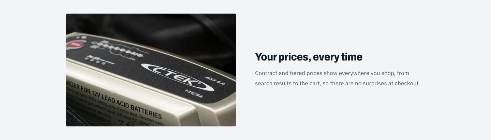
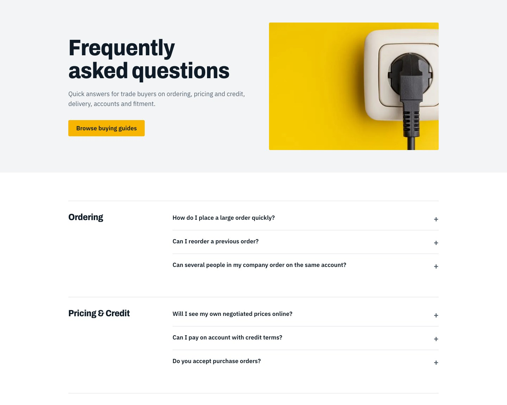

# Implementation details

How each feature works and where to find it. Paths are relative to `storefront/`.

## 1. Data layer

### Storyblok: `lib/storyblok.ts`, `lib/site.ts`, `lib/blog.ts`

- **`getStory(slug, locale, preview?, relations?)`** and **`getStories(params, locale, preview?)`** are the only entry points for reading.
  They pick the language (`default` / `fr`), the token and `version` (published with the Public token, or draft with the Preview token
  when `preview` is set), resolve the requested relation fields, and wrap the call in React `cache()` so one request fetches a story once.
  Missing stories return `undefined` (pages call `notFound()`).
- **`previewParams(searchParams)`** returns `{ draft: true }` only for a Visual Editor request with a valid signature
  ([visual-editor.md](visual-editor.md#how-draft-mode-is-switched-on)).
- **Mapping:** `lib/blog.ts` and `lib/site.ts` turn stories into the plain shapes the pages read (`Post`, `Guide`, `Faq`, `Spotlight`,
  `HomePage`, `Navigation`…): assets become `{ url }`, `cta_label` + `cta_href` become `{ title, href }`, one-per-line text becomes arrays,
  rich text becomes HTML (`bodyHtml`, `answerHtml`, `copy`). The shapes are the ones the ContentStack version used, so the components did not change.
- **`editTags(blok, story, preview)`** returns the Visual Editor attributes for a block (empty outside the editor); it is stored as `entry.$`,
  so components keep spreading `{...entry.$?.field}`.
- **Authors** are fetched once per request (`getAuthorMap`) and joined to posts and guides by uuid. Related FAQs and featured posts use
  `resolve_relations`.
- Fetchers are typed and locale-first: `getNavigation(locale)`, `getAnnouncement(locale)`, `getFaqs(locale)`, `getGuides(locale)`,
  `getGuide(locale, slug)`, `getSpotlights(locale)`, `getPage(locale, url)`, `getPosts(locale)`, `getPost(locale, slug)`, `getListingPage(locale)`.
- Detail stories are looked up by **full slug** (`blog/<slug>`, `guides/<slug>`). Slugs are identical in every language (see
  [decisions.md](decisions.md)). `getPage("/")` reads the `home` story, `getPage("/guides")` the `guides` folder's root story.
- Rich text (post bodies, FAQ answers) is converted to HTML by `renderRichText` from `@storyblok/richtext`.

### BigCommerce: `lib/bigcommerce.ts`

A thin GraphQL client (`gql()`), the query fragments, and typed functions. Details in [bigcommerce.md](bigcommerce.md).

## 2. Pages

| Route | File | Data |
|---|---|---|
| `/` | `app/[locale]/page.tsx` | the `home` page story (hero block, blocks) + spotlights, guides, BigCommerce cards |
| `/blog` | `blog/page.tsx` | `blog_listing_page` (the `blog` folder root story), `blog_post[]` |
| `/blog/[slug]` | `blog/[slug]/page.tsx` | one `blog_post` + author + related post |
| `/guides`, `/guides/[slug]` | `guides/…` | `buying_guide`, related FAQs, live BigCommerce products |
| `/faq` | `faq/page.tsx` | the `faq` page story + `faq[]` stories grouped by topic |
| `/products`, `/fr/produits` | `[root]/page.tsx` | BigCommerce faceted search over the whole catalog |
| `/products/<category>…`, `/fr/produits/<categorie>…` | `[root]/[...slug]/page.tsx` | category **or** product (see below) |
| `/cart` | `cart/page.tsx` | BigCommerce cart |

Pages treat a request from the Visual Editor (`?_storyblok=…` with a valid signature) as a draft preview and add `<EditSupport>`,
which loads the Storyblok bridge for the story they render.

### The catalog routes

BigCommerce translates catalog URLs, so the catalog lives at `/products/...` in English and `/fr/produits/...` in French (the root category
"Products" is "Produits" in French, and every category and product slug below it is translated too). The routes are
`app/[locale]/[root]/page.tsx` (listing) and `app/[locale]/[root]/[...slug]/page.tsx` (category or product), where `[root]` is the language's
catalog root (`CATALOG_ROOT` in `lib/i18n.ts`). Static routes (`/blog`, `/guides`, `/faq`, `/cart`) take precedence over `[root]`.

- The page rebuilds the BigCommerce path from `root` and the slug (`/produits/batteries-automobiles/...`) and resolves it **in the page's
  language**: a path only resolves in its own language. **One or two segments are categories, three or more are products.** If the guess is
  wrong the other interpretation is tried, and `notFound()` is raised if neither resolves.
- `ensureCatalogRoot()` (`lib/catalog-route.ts`): another language's root (an old or content-stored link such as `/fr/products/...`) is
  **permanently redirected** to the same page in this language; any other first segment is a 404.
- Product and category reads include `locales`, BigCommerce's list of the page's path in every language. It feeds `hreflang` / canonical
  tags (`alternatesFromPaths`) and the language switcher.
- **Language switcher:** on a catalog page it links to `/api/switch-locale?to=fr&path=<current path>`, which looks up the page's path in the
  target language and redirects (307), keeping the other query parameters and dropping attribute filters (`f.*`, whose values are translated).
  Other pages just swap the `/fr` prefix.
- `localePath(locale, "/products")` (the bare catalog link used in navigation, footer, buttons and breadcrumbs) maps to the language's root.
  Tiles and the mega menu use the translated paths from the category tree; tile photos are matched by category id.

## 3. Home page

The `home` story (a `page`) drives it:

- **Hero** (`components/hero.tsx`, `variant="home"`): headline, description and button come from the
  page's `hero_banner` block; its `image` and the page's own `image` are the two staggered photos (both selectable in the Visual Editor). A
  secondary "All products" button is added in code.
- **Intro** from the page's `intro` (rich text).
- **Shop by category** (`components/category-tiles.tsx`): the five top-level catalog categories as a photo mosaic. The
  photos are static files in `public/images/categories/`; labels are localized (`categoryLabel`).
- **Value blocks**: the page's `blocks` (`feature_block`s: title, copy, image, layout `image_left` / `image_right`).
- **Trade favourites**: `product_spotlight` stories with `is_featured`, enriched with live BigCommerce price, photo and link.
- **From the buying guides**: the first three guides.

*Trade favourites: editorial content from Storyblok with live price, photo and link from BigCommerce.*

*A value block from the page's `blocks` (title, copy, image, layout).*

*The guides strip: the first three guides, with photo, audience and read time.*

## 4. Navigation, mega menu and announcement bar

- **Header links** come from the `site_navigation` story (`settings/navigation`). The link whose `href` is `/products` is replaced by the
  **mega menu**.
- **Mega menu** (`components/mega-menu.tsx`, columns built in `components/site-chrome.tsx → megaColumns`): the live
  BigCommerce category tree (top level with subcategories and product counts), localized labels and a photo per top-level
  category. Hover previews it; a click pins it open; Escape, an outside click or navigating closes it. The panel is
  absolutely positioned under the header.
- **Announcement bar**: the first `announcement_bar` that is active, inside its date window and aimed at guests
  (`audience` is `everyone` or `guests`); style `info` (ink), `promo` or `warning` (amber).
- **Footer** columns, contact details and legal line come from `site_navigation`.
- **Cart link** shows the item count by reading the cart cookie and asking BigCommerce (`CartLink`, in a `Suspense`).

*The mega menu: five top-level categories with photos, subcategories and live product counts.*

## 5. Product listing and categories

`components/plp.tsx` renders: search box, result count, **active filter chips**, "Clear all", sort, facets, product
grid and pager. It is a plain GET `<form>`, wrapped by `components/plp-form.tsx`.

*A category with a search term and a technology filter applied: result count, chips with "Clear all", sort, facets, product grid.*

### Query parameters

| Parameter | Meaning |
|---|---|
| `q` | search text (3+ characters) |
| `brand` (repeatable) | brand entity IDs |
| `f.Technology`, `f.Voltage`, `f.Warranty` (repeatable) | attribute facet values |
| `min`, `max` | price range |
| `sort` | `featured` (default), `newest`, `best_selling`, `price_asc`, `price_desc`, `name_asc` |
| `after` / `before` | cursor pagination |

`parseCatalogParams()` reads them; `searchCatalog()` runs the query ([bigcommerce.md](bigcommerce.md)).

### Interaction model

- **Filters apply on click.** `PlpForm` listens for checkbox changes, serialises the form to a URL and calls
  `router.push(url, { scroll: false })` inside `useTransition`. The grid dims (`group-data-[pending=true]:opacity-50`)
  while the server re-renders. Without JavaScript the form still works as a normal GET form (a `<noscript>` button).
- **Search as you type** (`components/search-box.tsx`): submits 350 ms after typing stops, only for 3+ characters (or
  when emptied). One or two characters show a hint and do nothing; Enter is ignored below three.
- **Price range** (`components/price-range.tsx`): applies 700 ms after typing stops.
- **Chips and "Clear all"** are server-rendered links computed from the current parameters. Removing a chip changes the
  URL; the checkboxes, search box and price inputs then **reset themselves** to match: checkboxes via a `key` that
  includes their selected state, the search box and price range by comparing the URL value with the last value they sent.
- **Cursors reset on any filter change** (only `after`/`before` links keep them), because a cursor is valid only for the
  same filters and sort.
- Each facet shows at most **8 values** (`MAX_FACET_VALUES`), most populated first, and always keeps selected values.
- On screens narrower than 1024 px the filter panel starts **collapsed** (`components/filters-details.tsx`) so the grid is
  visible first; it stays open on desktop and without JavaScript.

*The filter sidebar for a category: brand, technology, voltage and warranty facets (at most 8 values each) and a price range.*

### Categories include subcategory products

A category's own product list is often empty (products sit in subcategories). The category page therefore runs the
faceted search with `categoryEntityId`, which includes all descendants, instead of reading `category.products`.

## 6. Product detail page

`ProductView` in `products/[...slug]/page.tsx`:

*The product page: gallery, brand, price with stock indicator, spotlight tagline, key specs and add to cart.*

- **Gallery** (`product-gallery.tsx`): main image + thumbnails (client state).
- **Header**: brand, name, SKU / MPN, price (sale and retail "was" price when applicable), stock indicator.
- **Spotlight join**: if a `product_spotlight` story has `bc_product_id` equal to this product, its **tagline**, badge and
  **"Best for"** use cases appear. **Guides join**: guides whose `recommended_bc_products` contains the ID are listed.
- **Key specs** (Voltage, Capacity, CCA, Technology, Warranty) and the full **specification table** come from
  BigCommerce custom fields; names and common values are translated by `translateSpec()`.
- **Volume pricing** table renders when BigCommerce returns bulk-pricing tiers.
- **Add to cart** (`components/add-to-cart.tsx`) respects the product's min/max purchase quantity.
- **Related products** from BigCommerce's `relatedProducts`.
- **Structured data**: a `schema.org/Product` JSON-LD block (price, currency, availability, SKU, GTIN, brand, images).
- **Metadata**: title, description, Open Graph image and hreflang alternates.

*Description, "Best for" use cases from the product spotlight, and the specification table from BigCommerce custom fields.*

## 7. Cart

- **State** lives in BigCommerce; the browser keeps only the cart ID in an httpOnly cookie `bc_cart_id` (30 days).
- **Server actions** (`app/actions/cart.ts`): `addToCartAction`, `setCartQuantityAction`, `removeFromCartAction`. Each
  creates the cart if needed, calls the BigCommerce mutation and `revalidatePath("/", "layout")` so the header badge refreshes.
- **`CartView`** (`components/cart-view.tsx`) edits optimistically:
  1. A quantity change updates the line total and the subtotal immediately.
  2. The save is debounced 500 ms per line; "Updating…" shows while anything is pending; checkout is disabled meanwhile.
  3. On success it calls `router.refresh()` to reload the server's numbers; on failure it shows an error and the server's
     numbers return on the next refresh.
  4. Removing is quantity 0 (saved immediately).
- **`QtyStepper`**: −, a typeable field (commits on blur/Enter), +; Arrow Up/Down keys; clamped to 1–999; accessible labels.
- **Checkout**: the cart's `redirectedCheckoutUrl` (BigCommerce hosted checkout) is created on each cart read.

*The cart with quantity steppers: totals update instantly and save to BigCommerce after a short pause.*

## 8. Content pages

- **Blog**: listing with hero, search (client-side text match over title and description), featured and all posts; post
  page with main column + author sidebar, related posts. Dates and labels follow the locale.
- **Buying guides**: guide cards; guide page with numbered steps (a true sequence), pro tips, a checklist, related FAQs and
  **recommended products** that link to product pages with live price.
- **FAQ**: grouped by `topic` (the select value is English; `topicLabel()` shows the French label), native
  `
` accordions.

*A buying guide: numbered steps, pro tips, a checklist panel and recommended products with live prices.*

*The FAQ page: hero banner, then questions grouped by topic.*

*A blog post: main column plus an author card.*

## 9. Editing support

`components/edit-support.tsx` renders the SDK's `StoryblokLiveEditing` for the story a page shows (only for editor requests). Block
attributes (`data-blok-c`, `data-blok-uid`) are spread from `entry.$.<field>` on key elements. See [visual-editor.md](visual-editor.md).

## 10. Internationalization

Routing in `proxy.ts`, strings and helpers in `lib/i18n.ts`. See [i18n.md](i18n.md).

## 11. Where to change things

| I want to… | Change |
|---|---|
| Edit wording, banners, FAQs, guides, nav | Storyblok (no code) |
| Add a UI string | `lib/i18n.ts` (`en` and `fr` objects, type-checked to match) |
| Add a filterable attribute | `FACET_NAMES` in `lib/bigcommerce.ts` (+ French label in `SPEC_NAMES_FR`) |
| Change the mega menu | `megaColumns()` in `components/site-chrome.tsx`, `components/mega-menu.tsx` |
| Change colours, type, spacing | tokens in `app/globals.css` |
| Add a page type | a component in `scripts/seed/schemas.py` (then run it), a route under `app/[locale]/`, a fetcher and mapper in `lib/`, edit tags, a seed |
