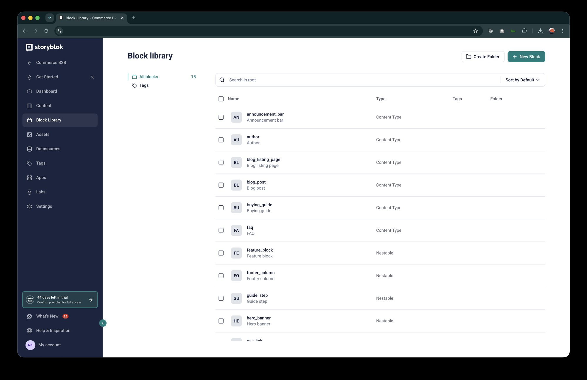
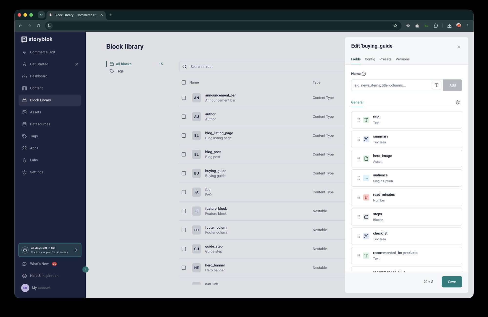
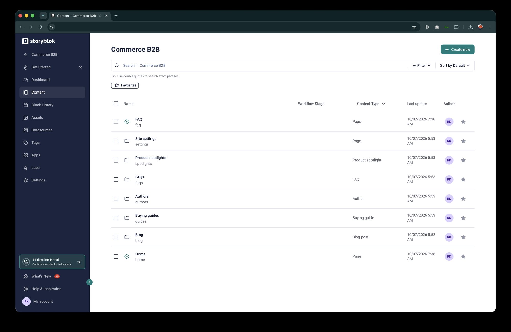
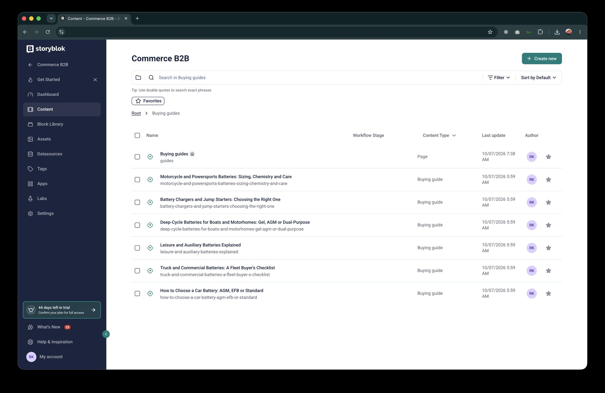
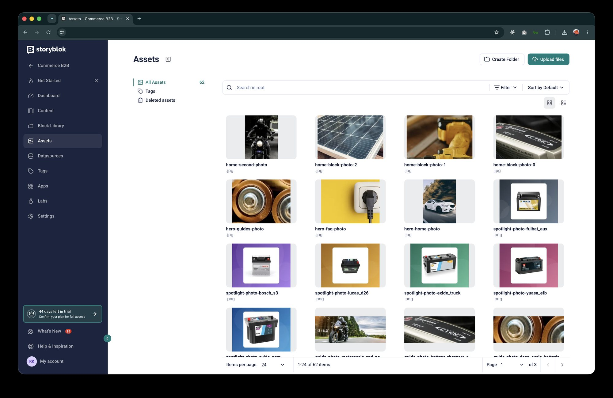

# Storyblok

## The space

| Setting | Value |
|---|---|
| Space | "Commerce B2B" (EU region) |
| Hosts (EU) | Management API `https://mapi.storyblok.com/v1`, Content Delivery API `https://api.storyblok.com/v2/cdn` (other regions: `api-us.`, `api-ca.`, `api-ap.`) |
| Languages | English (the default language, addressed as `default`) and French (`fr`), translated **per field** |
| Environments | None: a story has a draft and a published version; the **access token** chosen at read time decides which one you see |
| Visual Editor | Preview environments Production, Staging and Local ([visual-editor.md](visual-editor.md)) |

The region comes from `STORYBLOK_REGION` (`eu`, `us`, `ca`, `ap`, `cn`). A space created in one region is not reachable through another
region's host.

## Access tokens

| Token | Used by | Sees |
|---|---|---|
| **Public** (`STORYBLOK_PUBLIC_TOKEN`) | the live site | published content only (asking for drafts returns 401) |
| **Preview** (`STORYBLOK_PREVIEW_TOKEN`) | the Visual Editor and local development | drafts and published; kept server-side |
| **Personal access token** (`STORYBLOK_OAUTH_TOKEN`) | the seeding scripts (Management API) | read and write the whole space; **never** needed to run the site, never sent to a host or the browser |

Public, Preview, Asset and Theme tokens are created in the app (Settings → Access Tokens); the personal access token under
My Account → Account Settings. The storefront reads published content with the Public token and uses the Preview token only
when a request comes from the Visual Editor with a valid signature ([visual-editor.md](visual-editor.md#how-draft-mode-is-switched-on)).
If `STORYBLOK_PUBLIC_TOKEN` is missing, the Preview token is used with `version=published`, so nothing leaks, but the Public token is the intended one.

## Content model

Nine **content types** (a component with *Content type* enabled) and six reusable **blocks** (nestable components). All are
defined in `scripts/seed/schemas.py`.


*Block library: the nine content types (`Content Type`) and the nestable blocks (`Nestable`) of the model.*

### Content types

| Component | Purpose | Key fields |
|---|---|---|
| `page` | A page of the site: Home, FAQ, the buying-guides index | `title`, `description`, `hero` (one `hero_banner` block), `image`, `intro` (rich text), `blocks` (`feature_block`s), `seo_title`, `seo_description` |
| `blog_listing_page` | The blog index | `title`, `hero`, search texts, `featured_posts` and `related_posts` (references to posts) with their headings, SEO |
| `blog_post` | An article | `title`, `author` (reference), `date`, `featured_image`, `body` (rich text), `related_post` (reference), `is_archived`, SEO, `seo_keywords` |
| `author` | Article / guide author | `name`, `picture`, `bio` |
| `faq` | A question and rich-text answer | `question`, `answer`, `topic` (option), `sort_order`, `is_featured` |
| `buying_guide` | Step-by-step guide | `title`, `summary`, `hero_image`, `audience` (option), `read_minutes`, `steps` (`guide_step`s), `checklist` (one per line), `recommended_bc_products` and `recommended_skus` (comma-separated), `related_faqs` (references), `author` |
| `product_spotlight` | Editorial layer over a BigCommerce product | `title`, **`bc_product_id`**, `bc_sku`, `tagline`, `editorial_summary`, `key_features` (one per line), `use_cases` (`use_case`s), `badge` (option), `editorial_image`, `is_featured` |
| `announcement_bar` | Scheduled site-wide banner | `title` (internal), `message`, `cta_label`, `cta_href`, `style`, `audience`, `starts_at`, `ends_at`, `is_active` |
| `site_navigation` | Header, footer and contact details | `header_links` (`nav_link`s), `footer_columns` (`footer_column`s), `sales_email`, `support_phone`, `opening_hours`, `legal_text` |


*The `buying_guide` content type in the component editor: text, textarea, asset, single-option, number and blocks fields.*

### Blocks

`hero_banner` (title, description, image, `cta_label`, `cta_href`, `full_width`), `feature_block` (title, rich-text copy, image, layout
`image_left` / `image_right`), `guide_step`, `use_case`, `nav_link`, `footer_column`.

A hero is a **block inside the page** rather than a separate entry (as it was in the ContentStack version): it is only ever used once,
and a block is edited in place in the Visual Editor.

### Folders and URLs

| Folder | Holds | URL |
|---|---|---|
| (root) | `home`, `faq` | `/`, `/faq` |
| `blog/` | `blog_post` stories; the folder's **root story** is the blog listing | `/blog`, `/blog/<slug>` |
| `guides/` | `buying_guide` stories; the folder's root story is the guides index (a `page`) | `/guides`, `/guides/<slug>` |
| `authors/`, `faqs/`, `spotlights/` | stories shown inside other pages | no page of their own |
| `settings/` | `navigation` and the announcement bars | no page of their own |


*Content: the root of the space, with the `home` and `faq` stories and the folders `blog`, `guides`, `authors`, `faqs`, `spotlights` and `settings`.*


*Inside `guides/`: the folder root story (a Page, marked with the home icon) and the six buying guides.*

A story and a folder cannot share a slug at the same level, so `/blog` and `/guides` are folder **root stories** (`is_startpage`),
served by the Delivery API under the folder's slug (`blog`, `guides`).

### Field conventions

- **Translatable fields** store the French text next to the default: `title` and `title__i18n__fr`. Blocks inside a story translate the same way.
- **Enums** (`topic`, `audience`, `badge`, `style`) store fixed English values; the storefront maps them to French labels for display
  (`topicLabel`, `audienceLabel`, `badgeLabel` in `lib/i18n.ts`). Add a choice in both places.
- **Lists of strings** are one-per-line text areas (`checklist`, `key_features`) or comma-separated text (`recommended_bc_products`).
- **Numbers are strings** in the story JSON (`"377"`); **dates** are `YYYY-MM-DD HH:mm` (UTC).
- **Buttons** are `cta_label` + `cta_href` (a storefront path such as `/guides`); the app adds the `/fr` prefix.
- **Links between stories** (author, related FAQs, related posts) are `option` / `options` fields that store the target's **uuid**.

## Content volume (sample)

| Type | Stories |
|---|---|
| `author` | 6 |
| `blog_post` | 36 |
| `blog_listing_page` | 1 |
| `page` | 3 (`/`, `/faq`, `/guides`) |
| `faq` | 15 |
| `buying_guide` | 6 |
| `product_spotlight` | 6 |
| `announcement_bar` | 2 |
| `site_navigation` | 1 |

Plus 62 images in Assets. All content is fictional sample text, in English and French.


*Assets: the 62 images uploaded by the seeding script (hero photos, home blocks, spotlight cards, guide photos).*

## Reading content

All reads go through `lib/storyblok.ts` (`getStory`, `getStories`) and are mapped to the storefront's shapes by `lib/blog.ts` and
`lib/site.ts` ([implementation.md](implementation.md#1-data-layer)).

```
GET https://api.storyblok.com/v2/cdn/stories/guides/<slug>?version=published&language=fr&resolve_relations=buying_guide.related_faqs&token=<public token>
GET https://api.storyblok.com/v2/cdn/stories?starts_with=faqs/&content_type=faq&per_page=100&version=published&token=<public token>
```

- `language=default|fr` selects the translation; untranslated fields return the default value.
- `resolve_relations` makes the client merge referenced stories into `content` (the raw API returns them in a separate `rels` array).
- Lists return at most 100 stories per page.
- Published reads are cached by Next.js for 60 seconds; draft reads are never cached.

## Publishing

Saving a story creates or updates its **draft**; **Publish** makes the draft the published version for **all languages at once**
(field-level translation keeps both in one story). The live site shows published content within about a minute. There is no
per-environment or per-language publish step, and no approval gate: use the Visual Editor's draft preview, or the staging
deployment, to review before publishing ([operations.md](operations.md)).

## Plan and limits

- The space is on Storyblok's trial plan (Joyride), which expires around 21 November 2026; confirm a plan for continued use.
- The Management API allows about 3 requests per second; the seeding scripts pace themselves and retry on `429`.
