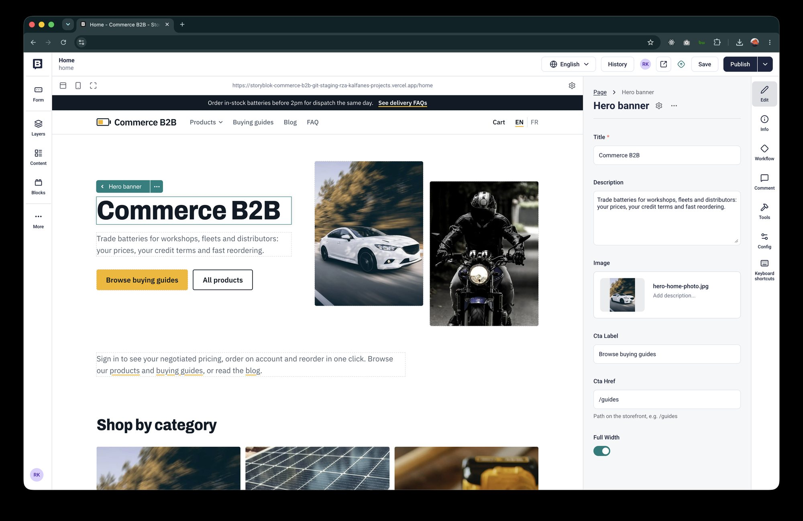
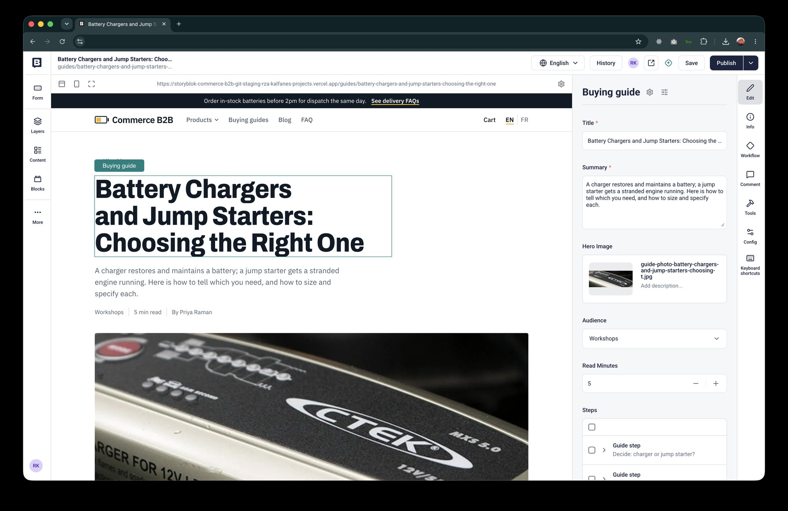
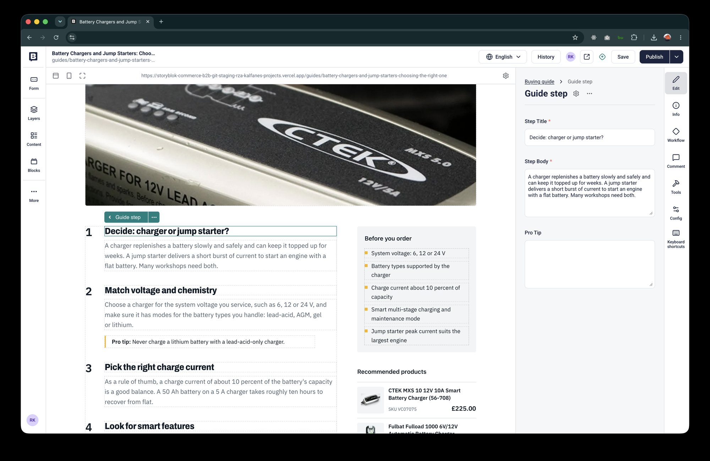
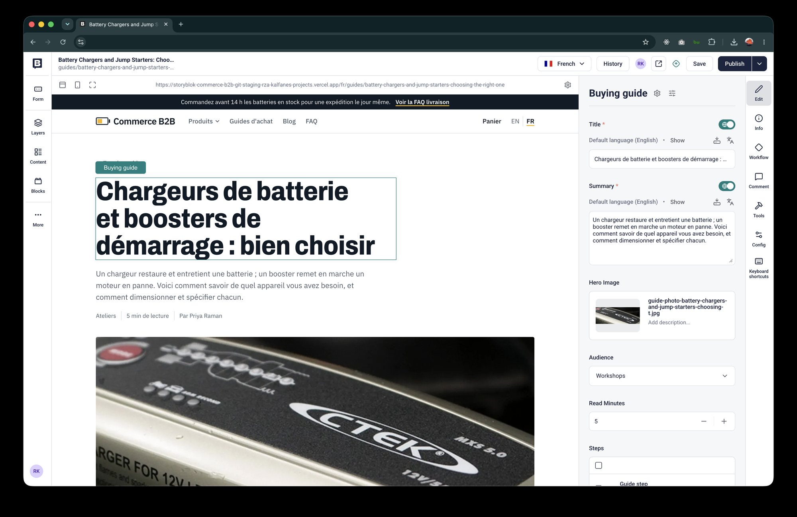

# Visual Editor

Editors work on the real site inside Storyblok's Visual Editor: click a block on the page to select it in the sidebar, change a
field, and see the page update as they type.

## How it fits together

```
Storyblok app ── iframe ──► storefront page  ?_storyblok=<story id>&_storyblok_lang=…&_storyblok_tk[…]=…
        ▲                          │ bridge (loaded only in the editor)
        └── input / change events ◄┘
```

1. The editor opens `<preview environment URL><story path>` in an iframe, adding `_storyblok` (the story id), `_storyblok_c`,
   `_storyblok_lang` and a signed `_storyblok_tk[space_id|timestamp|token]`.
2. The server recognises a valid editor request and renders the **draft** with the Preview token, adding `data-blok-c` and
   `data-blok-uid` attributes to the blocks.
3. `components/edit-support.tsx` renders the SDK's `StoryblokLiveEditing`, which loads the bridge **only when the page runs
   inside the editor iframe**. The bridge makes the attributes clickable and reports edits.
4. While someone types, the bridge sends the unsaved story to a server action, which stores it in a per-process cache and
   revalidates the page. The next server render reads the unsaved story instead of the saved one (live preview).
5. On **Save** or **Publish** the page reloads.

## How draft mode is switched on

`previewParams()` in `lib/storyblok.ts` returns a draft flag only when the request carries `_storyblok` **and** a valid signature:
`sha1("<space id>:<preview token>:<timestamp>")` equal to `_storyblok_tk[token]`, the space id matching, and the timestamp less than
an hour old. In development the signature is not required, so `?_storyblok=1` is enough locally.

Without that check, anyone could add `?_storyblok=1` to a URL and read unpublished content. On the live site a bare `?_storyblok=`,
a wrong signature and a missing signature all return the published page with no editing markup.

## Edit attributes

Storyblok selects **blocks**, not individual fields, so `editTags()` returns the same attributes for every field of a block
(`entry.$.title`, `entry.$.steps__parent`, …). The components keep the `{...entry.$?.field}` spread pattern from the ContentStack
version and need no changes. The attributes come from the story's `_editable` comment, or are built from the story id and block
`_uid` when a live-edit update arrives without it. In published HTML they are empty.

## Languages

The editor requests a language as a **path prefix** of the story path: `fr/guides/<slug>`, `fr/home`. The storefront already serves
`/fr/...`, and `proxy.ts` maps `/home` and `/fr/home` to the real home pages. In live-edit updates, the bridge's story carries all
languages as `field__i18n__fr`; `applyLanguage()` copies the active language over the base field before rendering, so French edits
show immediately.

## Preview environments and paths

Set by `python3 scripts/seed/editor.py` (Settings → Visual Editor; the script also clears any real path):

| Environment | URL |
|---|---|
| Production (default) | `https://storyblok-commerce-b2b.vercel.app/` |
| Staging | `https://storyblok-commerce-b2b-git-staging-rza-kalfanes-projects.vercel.app/` |
| Local | `https://localhost:3000/` (run `npm run dev:https` and accept the certificate once; the editor requires HTTPS) |

**No real paths.** Do not set a "real path" on stories: Storyblok uses it as-is and **drops the language prefix**, so a French edit of Home
(real path `/`) opened the English page. Without one the editor opens `<URL><slug>` and `<URL>fr/<slug>`. Stories with no page of their own
are mapped by `proxy.ts`, **only for editor requests** (`_storyblok` in the query): `home` and `fr/home` to the home pages, `faqs/<slug>` to `/faq`,
`authors/<slug>` to `/blog`, and `spotlights/<slug>` and `settings/<slug>` to `/`, in both languages. Blog posts and guides need nothing
(`/blog/<slug>`, `/guides/<slug>`).

The CSP `frame-ancestors` header allows only `https://app.storyblok.com` and `https://*.storyblok.com` (and `localhost` in
development).

## Using it

1. In Storyblok open **Content**, pick a story (for example the Home story or a buying guide).
2. The Visual Editor shows the page. Click a block to select it, edit fields in the sidebar, switch language with the language menu.
3. Typing updates the page; **Save** keeps the draft, **Publish** makes it live.


*Home: the hero banner block is selected on the page and its fields (title, description, image, call to action) are in the sidebar.*


*A buying guide in English: clicking the title selects the story; the sidebar shows its fields.*


*Clicking a numbered step on the page selects that `guide_step` block (title, body, pro tip) inside the story.*


*The same guide with the language menu on French: the preview loads `/fr/guides/…`, and each translatable field shows its French value under the default-language text.*

## Troubleshooting

| Symptom | Cause | Fix |
|---|---|---|
| Blank frame, "refused to connect" | the CSP does not allow the editor, or the environment URL is wrong | check the `Content-Security-Policy` header and the environment URL |
| Page loads but nothing is clickable | draft mode not on (bad or old signature), or the preview token differs from the deployment's | open the page from the editor again; check `STORYBLOK_PREVIEW_TOKEN` on that deployment |
| Editor opens a 404 (`/faqs/…`) | the story's folder is not mapped in `proxy.ts` (`EDITOR_PAGE`) | add the folder there; do not use a real path |
| French editor shows the English page | the story has a **real path** (it removes the `fr/` prefix) | clear it (`editor.py`) |
| Typing does not update the page | the bridge is not registered | `_storyblok` must equal the story id, and the page must be inside the iframe |
| French edits show English text while typing | live-edit update not localized | see `applyLanguage()` in `lib/storyblok.ts` |
| Local editing fails | not on HTTPS | `npm run dev:https` and accept the certificate |
| Live edits only sometimes appear on Vercel | the live-edit cache is per server instance | can be intermittent on serverless; Save reloads the page, and local development is reliable |

The bridge is bundled in the page (the SDK imports it dynamically), so there is no script to look for in the network tab: in the
browser console, `window.StoryblokBridge` and `window.storyblokRegisterEvent` exist once it has loaded.
