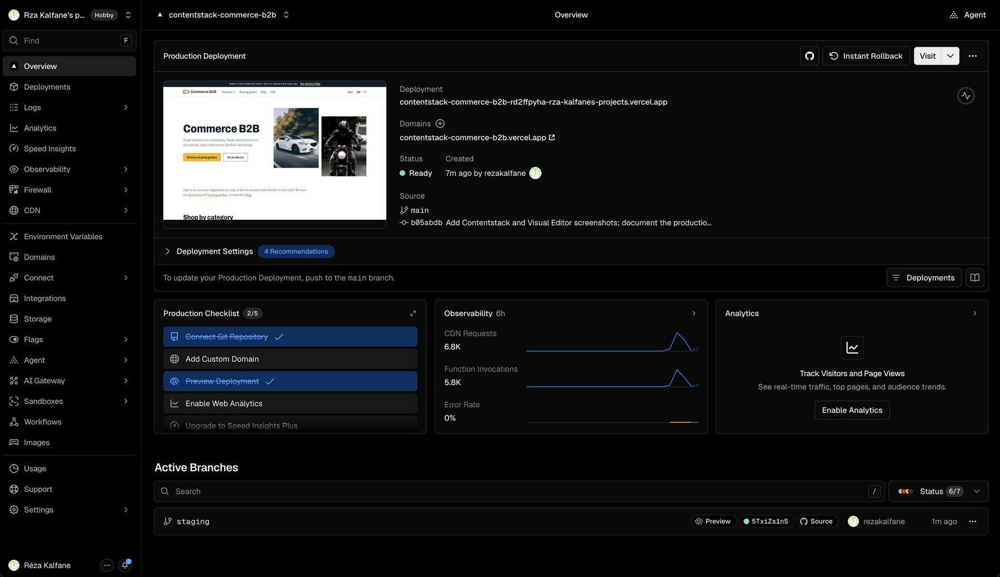
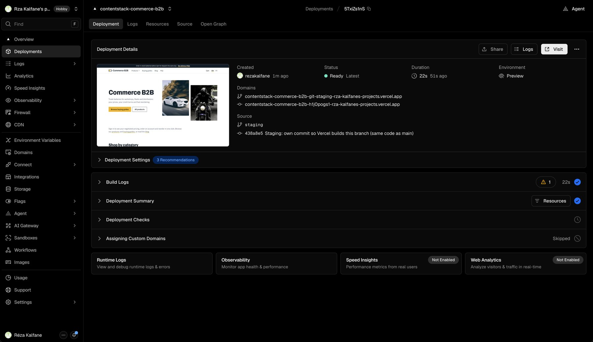
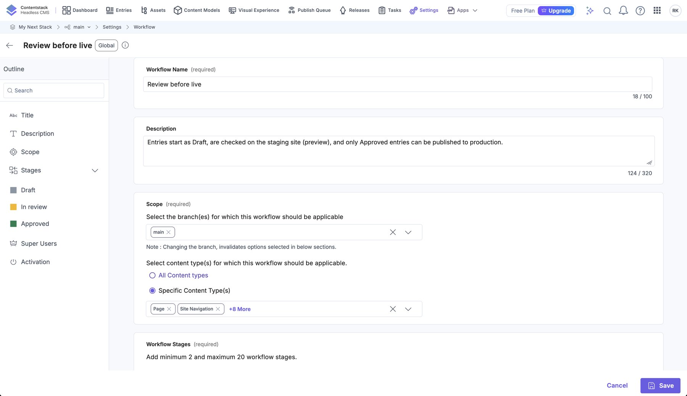
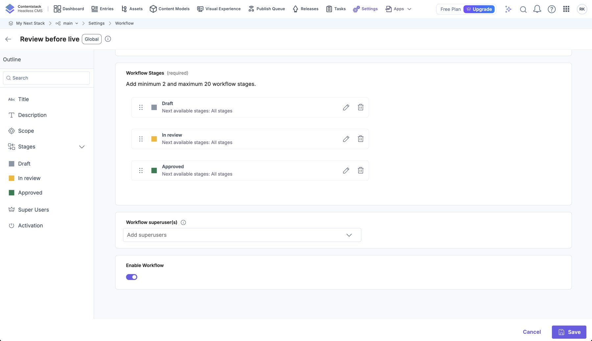
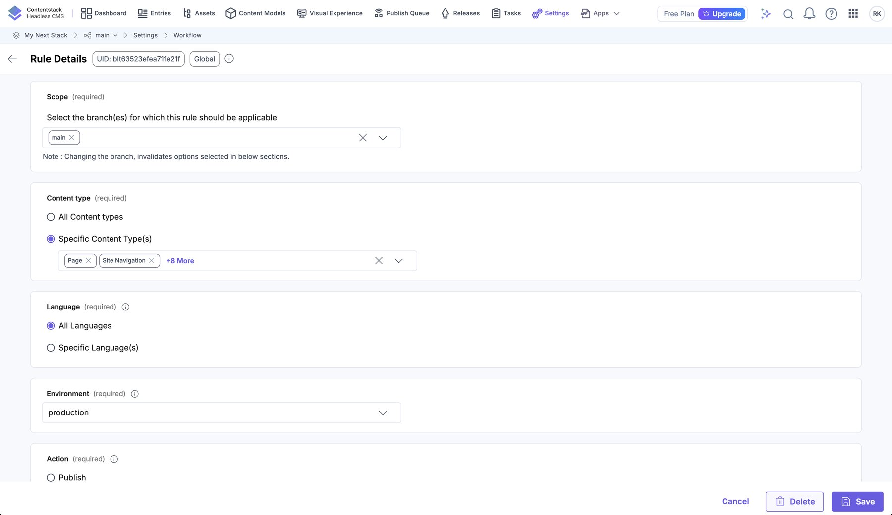
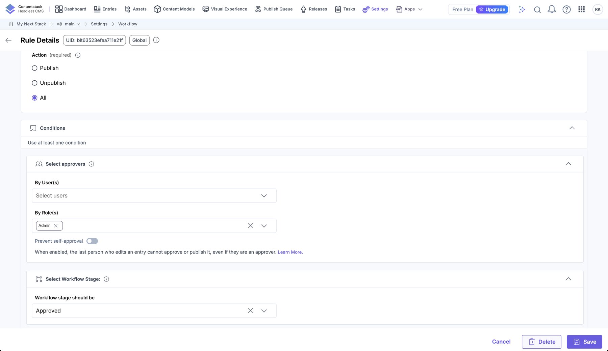

# Editorial workflow: review before live

Content goes live in two steps: it is **checked on a staging site first**, and **only approved content can be published to
production**. The first step is a site (the `staging` branch on Vercel, reading Contentstack's `preview` environment); the
second is enforced by a Contentstack **workflow** and a **publishing rule**.

```
 edit in Contentstack          publish to preview            approve              publish to production
 (entry starts as Draft) ───► check the STAGING site ───► move entry to ───► production site updates
                               (English and French)         Approved            (refused unless Approved)
```

## The three sites

| Site | URL | Reads Contentstack environment | Code branch | Purpose |
|---|---|---|---|---|
| **Production** | https://contentstack-commerce-b2b.vercel.app | `production` | `main` | the live site |
| **Staging** | https://contentstack-commerce-b2b-git-staging-rza-kalfanes-projects.vercel.app | `preview` | `staging` | review changes before they go live |
| **Local** | http://localhost:3000 | `preview` (from `.env.local`) | your working copy | development |

Each site reports which environment it reads in an `X-Content-Environment` response header:

```bash
curl -sI https://contentstack-commerce-b2b.vercel.app | grep -i x-content      # production
curl -sI https://contentstack-commerce-b2b-git-staging-rza-kalfanes-projects.vercel.app | grep -i x-content   # preview
```


*Settings → Environments. Each environment has a Live Preview base URL per locale: `production` → the live site, `preview` →
the staging site, `local` → localhost (Visual Editor can open any of them; nothing is published to `local`).*

### The staging site

- It is the **same code as `main`**, deployed from the `staging` branch. A GitHub Action
  (`.github/workflows/sync-staging.yml`) rebuilds `staging` from `main` after every push, adding its own empty commit. That
  commit matters: Vercel does not build a branch whose tip it has already built, so without it staging would never update.
- It reads **`preview` content**, because Vercel's *Preview* scope has `CONTENTSTACK_ENVIRONMENT=preview` and the preview
  environment's tokens. Production's scope has `production` and its own tokens ([operations.md](operations.md)).
- Its URL is **stable** (Vercel's branch alias) and **public**: deployment protection was switched off for previews so
  reviewers and Contentstack's embedded Live Preview can open it without a Vercel login. Vercel sends `X-Robots-Tag: noindex`
  on previews, so search engines are told to ignore it. Everything on it is unpublished-to-production content, so share the
  link deliberately.


*Vercel project overview: the production deployment from `main` and the `staging` branch under Active Branches.*


*The staging deployment: Environment **Preview**, source branch `staging`, and its stable branch domain.*

## The Contentstack workflow

A workflow named **Review before live** applies to all ten content types on the `main` branch. Every entry, in each language,
is in one of three stages:

| Stage | Meaning | Who can move an entry into it |
|---|---|---|
| **Draft** | being written (new entries start here) | anyone |
| **In review** | ready to be checked on the staging site | anyone |
| **Approved** | checked and cleared for the live site | the **Admin** role |


*Settings → Workflows → Review before live: name, description and scope (branch `main`, the ten content types).*


*The three stages, with their colours. Entries can move between any stages (next available stages: all).*

When the workflow was introduced, all 160 existing entries (80 per language) were set to **Approved**, because that content
was already live; otherwise the publishing rule would have locked every existing entry.

## The publishing rule (the actual gate)

Stages alone do not stop anyone. The **publishing rule** does:

| Setting | Value |
|---|---|
| Environment | `production` |
| Content types / languages | all ten / English and French |
| Action | all (publish and unpublish) |
| Workflow stage must be | **Approved** |
| Approvers | the **Admin** role |
| Prevent self-approval | off (one-person team; turn on when there is a second approver) |


*Rule scope: branch `main`, the ten content types, all languages, environment `production`.*


*Rule conditions: action **All**, approvers by role (**Admin**), and "workflow stage should be **Approved**".*

Publishing to **`preview`** has no rule: it is always allowed, which is what makes the staging site possible.

### Tested behaviour

Tested through the API with a temporary entry (deleted afterwards):

| Action | Result |
|---|---|
| Publish a **Draft** entry to `production` | **Refused**: *"…workflow stage requirements specified by the Publish Rule … have not been met"* |
| Publish a **Draft** entry to `preview` | Allowed |
| Publish an **In review** entry to `production` | **Refused** |
| Publish an **Approved** entry to `production` | Allowed |
| Update an Approved entry (script) | Allowed; it stays Approved |
| Move an Approved entry back to Draft with the script token | Refused: only the Admin role may |

## The editor routine

1. **Edit** the entry in Contentstack (entries form, or click the page in Visual Editor). New entries start in **Draft**.
   When you start editing an already approved entry, move it to **In review** so the change is visibly pending (see the
   limitation below).
2. **Publish to `preview`** (publish dialog → environment `preview`, both languages if both changed).
3. **Check the staging site**, in English and in `/fr`. Look at the page, the listing it appears in, and the language switcher.
4. **Approve**: set the entry's workflow stage to **Approved** (Admin).
5. **Publish to `production`**. If the stage is not Approved, Contentstack refuses and says which rule was not met.
6. **Verify live**: open the production page; for a bulk change, confirm the header says `production`.

For a **batch** of related changes, a Contentstack **Release** can bundle them and deploy them to an environment together.

## What the gate does *not* cover

Be clear about its limits:

- **Editing an Approved entry does not reset its stage.** The check happens at publish time and looks only at the current
  stage. If an Approved entry is edited and then published straight to `production`, the rule allows it. The routine above
  (move to *In review* while editing) is a habit, not an enforcement. Contentstack has no setting that sends an entry back to
  Draft automatically after an edit.
- **Self-approval.** With one Admin, the person who edited also approves. Turn on *Prevent self-approval* in the publishing
  rule when a second approver exists.
- **Scripts.** The management token used by the seeding scripts is a developer credential and is treated as permitted.
  `publish_environment.py production` refuses non-Approved entries unless run with `--approve`, which is an explicit
  developer decision; `seed*.py` publish to the environment in `.env.local` (`preview`), not `production`.
- **Code.** This gates **content** only. Code changes deploy to production automatically on every push to `main`; a
  review gate for code belongs in GitHub (branch protection, pull requests), which is not set up.
- **Assets.** Publishing an asset to `production` is not gated (the rule applies to entries).

## Setting it up from scratch

The workflow and rule are created by an idempotent script, so a new stack can be set up the same way:

```bash
python3 scripts/seed/workflow.py              # creates the workflow and the production publishing rule (skips what exists)
python3 scripts/seed/workflow.py --baseline   # ...and marks every existing entry Approved (once, on a stack already live)
```

The staging side needs three things: a `staging` branch, Vercel Preview-scope variables that point at the `preview`
environment, and (for a public staging URL) Vercel's SSO protection off for previews:

```bash
vercel project protection disable --sso contentstack-commerce-b2b --scope <team>
git push origin main:staging          # first time; afterwards the GitHub Action keeps it in sync
```

Then, in Contentstack, set the **`preview` environment's Live Preview base URL** to the staging URL (Settings →
Environments), as in the screenshot above.

## API notes (things that were not obvious)

| Topic | Detail |
|---|---|
| Endpoint name | `POST /v3/workflows/publishing_rules` (not `publish_rules`) |
| Content types in a rule | must be listed explicitly when the workflow is scoped to specific types; `$all` is rejected |
| Approvers | plain **role** UIDs (`"roles": ["blt…"]`); a user approver must be a real stack member, so a role is used |
| Reading the stage | add `include_workflow=true` to the entry request; without it `_workflow` is absent |
| Moving a stage | `POST /v3/content_types/<ct>/entries/<uid>/workflow?locale=<code>`; each language has its own stage |
| Stage restrictions | a stage's ACL decides who may move entries *out of* it; the Approved stage is Admin-only |

## Troubleshooting

| Symptom | Cause / fix |
|---|---|
| *"…requirements specified by the Publish Rule … have not been met"* | the entry (in that language) is not Approved: set its stage, then publish |
| A French page is not refused/allowed like the English one | stages are **per language**: check the `fr-fr` entry's stage |
| Staging shows old code | the sync Action did not run or Vercel skipped the build; check *Actions → Sync staging with main* |
| Staging shows content that is not on production | expected: it reads `preview`; publish to `production` after approval |
| Staging asks for a Vercel login | preview deployment protection is on; see *Setting it up* |
| `publish_environment.py production` fails for new entries | they are in Draft; review them, then run with `--approve` (or approve in the app) |
